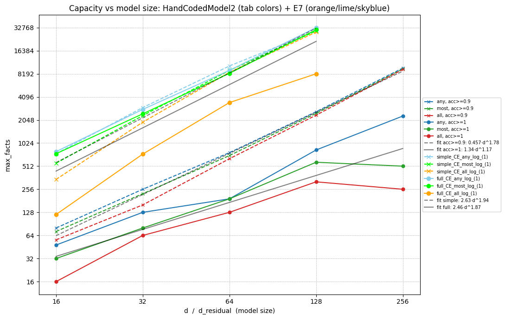
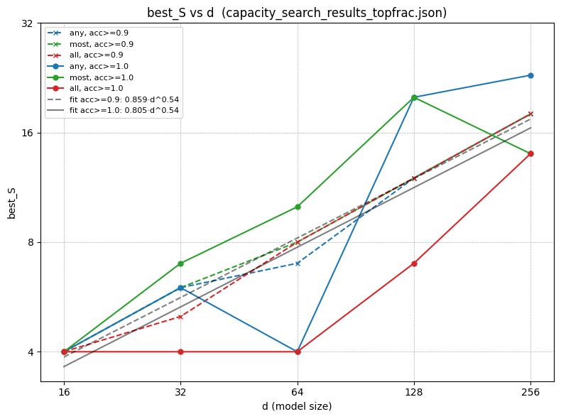
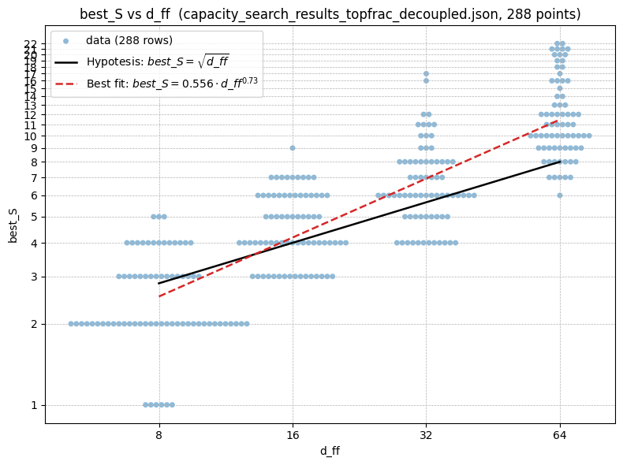
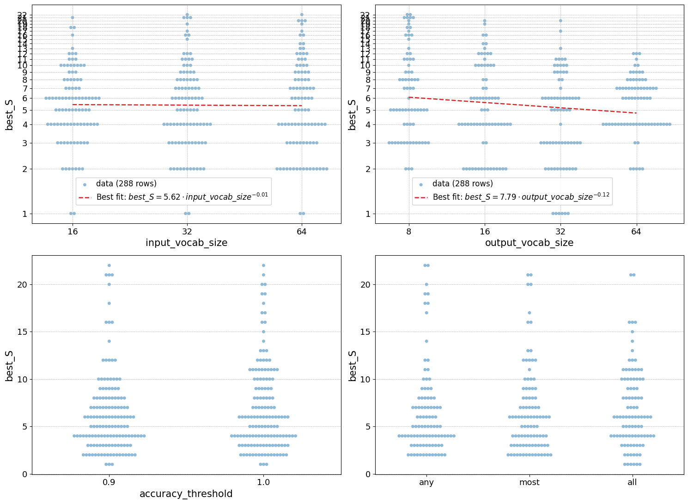

# Why sequence memorization
The goal of this research is to get a clearer understanding of how factual look-ups are encoded in LLMs.

I expect that a lot of the information stored in the weights of a LLM is memorized facts, rather than general circuits. I don't assume a clean separation between what is a "general circuit" vs a "memorized fact", but a clear example of the former is this [addition circuit](https://arxiv.org/abs/2605.01148), and a clear example of the latter is [knowing what sport some specific athlete is playing](https://www.lesswrong.com/s/hpWHhjvjn67LJ4xXX/p/iGuwZTHWb6DFY3sKB).

The goal of mech-interp is to be able to take a model (possibly together with its training data), and pick it apart into different components that do human understandable tasks. Since I expect that many of these tasks are factual look-ups, it would be useful to know what we should expect look-up to look like in a transformer model.

*Honorable mention:* One example of factual lookup (not studied in this post) is [bi-gram statistics, which is encoded in the embedding + unembedding matrices](https://transformer-circuits.pub/2021/framework/index.html#zero-layer-transformers). 

In this post, I study sequence memorization as a toy model for any factual lookup where some combination of multiple tokens carries a meaning that is substantially different from any linear combination of the individual tokens. 

# The training data

The training data are sequences of three tokens, two input tokens and one output token. Given an input of two tokens, the network is trained to predict the next token (i.e. the output token).

Hyperparameters for the data generation:

- input token vocabulary size
- output token vocabulary size

In my experiments, the input token vocabulary size is always twice the size of the output token vocabulary.[^1]

[^1]: I started out the experiments, having them the same size, but the network learned all the facts to easily, so I doubled the input vocabulary size in order to have more possible facts.

## Generating the training data

The code for generating the training data is not very long, and is quoted below if you prefer to read code

The inputs are

- `n_facts` -- Number of facts.
- `input_len` -- Number of input tokens. *This value is always 2.*
- `input_vocab_size`
- `output_vocab_size`
- `seed` -- Random seed. *This value is always 42.*[^2]

[^2]: I used a fixed random seed to avoid some runs getting lucky and getting easier facts, and to specifically have the same facts for trained networks and hand-coded networks. However this last aim failed because torch random functions give different results different when run on CPU vs GPU, even with the seed is the same. However, this probably isn't a significant concern.

The code first generates a list of every possible input combination. Then this list is shuffled, and the first `n_fact` pairs from the shuffled list are used as the inputs for the `n_fact` facts. These facts are then divided as equal as is possible among the `output_vocab_size` target labels.

*[Make a collapsible box for the code below]*

```python
def generate_facts(n_facts: int, # of facts to generate,
                   input_len: int, # number of input tokens per fact   
                   input_vocab_size: int, # of unique tokens in the vocabulary
                   output_vocab_size: int, # of unique targets
                   seed: int = 42
                  ) -> dict[str, torch.Tensor]:
    
    if n_facts > input_vocab_size ** input_len:
        raise ValueError(f"Cannot generate {n_facts} unique facts with a vocabulary of size {input_vocab_size} and input length {input_len}. Maximum unique facts: {input_vocab_size ** input_len}")
    
    device = torch.tensor(0).device  # respect default device
    generator = torch.Generator(device=device).manual_seed(seed)

    targets = torch.arange(n_facts) % output_vocab_size

    if input_len == 1:
        inputs = torch.randperm(input_vocab_size, generator=generator)[:n_facts].unsqueeze(1)
    elif input_len == 2:
        all_possible_inputs = torch.cartesian_prod(torch.arange(input_vocab_size), torch.arange(input_vocab_size))
        inputs = all_possible_inputs[torch.randperm(all_possible_inputs.size(0), generator=generator)[:n_facts]]
    else:
        inputs = torch.randint(0, input_vocab_size, (n_facts, input_len), generator=generator)

    sorted_indices = torch.argsort(targets)    
    return {"inputs": inputs[sorted_indices], "targets": targets[sorted_indices]}
```

# Model Architecture

The full toy model is a small one layer transformer. In addition to training the full model, I also try turning off various parts in various combination, to see what parts of the model is important for the sequence memorization task.

The full toy model consist of:

- Token embeddings
- Positional embeddeings
- A single full width attention head
- A MLP layer (on the last token position only since I'm not trying to predict intermediate tokens)
- Two residual connections, one passed the attention, and one passed the MLP.
- Token unembedding to create the logits for the target tokens.
- Three RMS Norms, one applied to the input to the attention, one to the input to the MLP and one to the input to the unembedding.


*Figure 1: The full toy transformer model, with all the different parts present.*

## Model variations

### Attention

There are the variants when it comes to the attention.

- **None:**
  There is no attention head, and no positional embedding. Instead, there is two different token embeddings, one for each position. These are simply added together to make the first residual stream activation.

- **Uniform:**
  I remove the attention pattern $\mathrm{softmax}(QK^\top)$ and replace it with a uniform $\frac{1}{2}$.

- **Full:**
  One normal attention head.

## MLP

There are a number of variants regarding the MLP. Firstly the MLP can either be present or be missing. Secondly if there is an MLP layer, each of the following can be varied

- **Activation Function** can be either $\mathrm{GELU}$ or $\mathrm{ReLU}$
- **Bias** can exist or not.[^3]
- **Residual connection** around the MLP can exist or not.

[^3]: If the bias is present that means both the linear readout and the linear projection from the ReLU or GELU neurons, have bias. (Making them actually not linear functions but affine function, in strict math terminology.) If there is no bias, this means neither of these have bias. All other linear connections in the rest of the network (e.g. embeddings, etc) are always bias free.

## Norms

The norms can also be turned on and off. Each of the norms for the readin to the attention and MLP only exist if both that part of the network is present (Uniform or Full for the attention), and Norms are turned on. The last norm, just before the unembedding only depends on the norm setting, and are there if norms are turned on and not there if norms are turned off.


*Figure 2: A simplified version of the toy model. The MLP is present but everything else (attention, norms, residual connection around the MLP) is turned off.*

# First experiment and result: What parts of the network matters?

I trained all different versions of the toy model, to see how many facts each of them could learn. There are some patterns, but unfortunately for most of them, I can't separate what is due to expressibility of the model and what is due to learnability.

For this experiment, I used a single model size across all architectures:
- $n_{input\_vocab} = 32$
- $d_{residual} = 16$
- $d_{MLP} = 16$
- $n_{output\_vocab} = 16$ 


I say that a model has "learned a fact" if: When the model is given the first two tokens of this sequence, it correctly predicts the correct third token. And by "correctly predicts" I mean that argmaxing over the logits locates the correct output token.

To find out the maximum number of facts a model can learn, I performed a binary search over number of facts, to find the highest number of facts such that the model learned all of them.

For each number of facts I trained 11 models in parallel, with the exact same facts, but different random initialized weights. I used three different success criterions "Any", "Most" and "All", meaning that I said the model succeeded at learning all the facts, if it succeeded in any, most or all of the 11 trials.

For each architecture and each of Any/Most/All I ran a binary search to find the maximum number of facts it could learn. Furthermore, I repeated each such binary search 4 times, to check for stability. The "Any" setting had the highest stability (similar max number of fact over all 4 duplicate experiments), and "All" had the worst stability.[^4]

[^4]: It's not surprising that "All" had bad stability, since it only takes one bad run to throw off the entire batch. But it was not a priori obvious to me that "Any" would be more stable than "Most".

All the results for all the experiments are shown in the table below 


*Table 1: Maximum facts memorized for each model architecture. Within each group the row-wise maximum is shown in bold and values more than 20% from the group's median are boxed as outliers. Note that 1024 is the dataset ceiling, so configurations reaching it have saturated the data rather than the model.*

## Norms + No Residual around MLP + No Bias + ReLU = Bad

This combination is extra bad for some reason. I don't know why. Specifically, I don't know if the limitation is due to training dynamics or due to what is possible for this architecture.

## No Attention > Uniform Attention > Full Attention

It's not surprising that no attention does the best, since the dual embedding that I use to replace attention is (arguably) more powerful. Because attention is non-linear, and the dual embedding is linear, there are thing that the attention can express that the dual embedding can't. But on the other hand, the dual embedding gets to encode the input for each token position entirely separately, which gives the network more freedom. Additionally, the no attention setup should be easier to train, since it's simpler.

More surprising is that uniform attention is outperforming full attention, given that full attention is strictly more powerful. Therefore, this has to be because of ease of training. This interpretation is also supported by the fact that the number of fact these networks mange to learn is unstable. I can see this in that in the number of outliers in the table below and also how much number of facts drop from Any to Majority to All.

## MLP

Removing the MLP approximately cuts the number of learnable facts in half.

## Norms

Norms are generally useful for learning more facts, with one exception. Norms make a bigger difference if there are no MLP.

- If there is no MLP the norm increases the number of learnable facts with 79% - 191.7%[^5]
- If there is [No Residual around MLP + No Bias + ReLU] than adding Norm makes things worse because [Norm + No Residual around MLP + No Bias + ReLU] is extra bad.
- In the rest of the settings, having norms is increasing the number of learnable facts with 2.2% - 42.2%[^6]

[^5]: Based on data from "Any" the numbers are similar for "Majority" and larger for "All"

[^6]: Same as last footnote

## Residual Connection around the MLP

Adding this residual connection increases the number of learnable facts with 3.1% - 34%[^7]

[^7]: Based on data from "Any" the numbers are typically larger for "Majority" and larger for "All"

The one outlier is the case Norm + No Bias + GeLU, where adding a Norm makes a much larger difference, because of the extra bad synergy of Norms + No Residual around MLP + No Bias

## Activation Function

GELU is typically better than ReLU. The difference is typically small -0.2% to +12.7% from changing from ReLU to GELU.

Again the exception is Norm + No Residual around the MLP + No Bias, where switching from ReLU to GELU boosts the number of learnable facts with 58% - 79%.


# Challenge / Benchmark for understanding

Can you or me, write down weights for the memory toy model, either by hand or some algorithm that isn't gradient descent, such that our resulting model match the performance of the learned model?

This challenge is a benchmark for how well we understand how the model store the facts. There are two reasons why this is a useful framing.

- If we understand how the facts are embedded, we should be able to replicate this, without gradient descent.
- Thinking about "How would I do this?" can be a useful framing for mech-interp.

I think that my current best attempt (which is presented further down) is some non-zero progress on this challenge, but there are still far to go. I encourage all readers give it a try yourself.

## Model architecture

Firstly, I'm not trying (yet) to produce weights for the full transformer model, but instead aiming to find functional weights for the simplified toy model shown in *Figure 2*.

Secondly, the version shown in *Figure 2* has unnecessarily many weights, which is a legacy from being a cut down version of the full version shown in *Figure 1*. Because the MLP is sandwich between two linear operations, I can skip the weight matrices of the MLP.

I can simplify it further down to this: 


*Figure 3: This model architecture is equivalent to the toy model configuration with settings Attn=None, MLP=✅, Norm=❌, Res=❌, Bias=❌, Act=ReLU.*

If you want to give the challenge a go, feel free to use this architecture, or any other that you find easier to work with. The final goal is to be able to write down functional weights for the full transformer model, but I think it's ok to start with a simpler case.

# My attempt

My algorithm has three steps

- Assign $S$ number ReLU neurons to each label. This means that each neuron will be assigned to several labels. These assignments should achieve both of: Each neuron should have approximately the same labels assigned to it as any other neuron; The max neuron overlap between any pair of labels, should be as small as possible.
- Choose the embedding weights such that each ReLU neuron assigned to label $l$ will output zero for all facts with label $l$.
- Assigned negative weights going from ReLU neurons assigned to label $l$, to the logit for $l$.

### Assigning neurons to labels
There are $d_{MLP}$ ReLU neurons, and $n_{output\_vocab}$ labels. Each label gets assigned $S\geq1$ neurons. In most of my experiments $d_{MLP}=n_{output\_vocab}$, which means for any $S>1$, the assignments will overlap.

One problem my network needs to solve is that there will likely be some pattern of facts
- $a,b$ -> $l$
- $c,d$ -> $l$
- $a,d$ -> not $l$

Any weight allocation, on this model architecture, where the logit for some label only depends on a single ReLU neuron, will fail at encoding this pattern. Therefore, the network either needs more ReLU neurons than labels (not realistic) or the labels will have to somehow share neurons, i.e. some sort of superposition encoding. 

I don't know a priori what is the best value of $S$, therefore $S$ is given as a hyperparameter, to search over later. Given $S$, $d_{MLP}$ and $n_{output\_vocab}$, I want to find an allocation where the allocations are spread out nicely. I.e. I want all neurons to be used by approximately the same number of labels, and I want to minimize the max neuron overlap between any pair of labels. 

I had Claude Code write the script that does this, and verified that the outputs look good. There are probably many ways to achieve similar allocations, and I can't think of any reason why the exact method matters, so I will not go into this further.

### Embedding weights
Next step is to make sure that any ReLU neurons always output zero on all facts with a label assigned to that neuron. 

The algorithm in broad strokes:

1. For each neuron, I list all facts with a label that is assigned to that neuron. 
2. For the first input token, I count how many times each token appear in this list of facts, I then take $top\_fraction$ of these input tokens and assign them the $weight = -1$, to that neuron.
3. Repeat step 2 for the second input token.
4. Find any fact that is not covered by step 2 and 3, and assign $weight = 0$ to both first and second input tokens for all such facts.
5. Assign $weight = 1$ to all remaining input tokens.


### Unembedding weights
The last step is simple. Each unembedding weight is $-1$ from ReLU neurons to labels assigned to that neuron, and $0$ everywhere else. 

I did also try assigning positive values everywhere else, but for the success criteria I use (looking at arg_max of the logits), adding these positive values makes no difference. I fist noticed this empirically, but it's also a mathematical fact.

## Results
As to be expected, my hand coded models are not as good as trained models, and it especially struggles to reach full accuracy. But if I accept 90% accuracy for the hand coded model, it scales almost as well as the trained model, but with a significantly worse pre-factor.

The plot below shows my data from binary search to find maximum number of fact a model can learn. 
- The trained models are using the architectures "full" (Figure 1, GELU and bias) and "simple" (Figure 2, with ReLU and no bias). These models are trained on Cross-Entropy loss.
- The handcoded models are generated according to the algorithm described in the previous section. For each datapoint I selected the best result from a hyperparameter sweep over $S$ and $top\_fraction$
- All models are evaluated on accuracy, by which I mean percentage of facts it correctly predicts. This is calculated as $mean(argmax(logits)==labels)$
- For the trained models, the required accuracy is always 100%, for the handcoded models, I show the result for both required accuracy 90% and 100%. 
- Each experiment is run 11 times with the same facts but different random initialisations (for the trained models) or different random shuffles of neuron allocations, and different shufflings as tiebreaker in step 2 Embedding weights (for the hand coded models). "any"/"most"/"all" indicate if the success criteria is that any most or all of the runs needs to reach the desired accuracy.
- Best fit lines are over aggregations of any/most/all.
- $d$ is the dimension of the model. $n_{input\_vocab}=2d$, $d_{MLP}=d$, $n_{output\_vocab}=d$


*Figure 4: Maximum number of facts learnable by different models*

### Optimal S is the square root of number of ReLU neurons
To get the best version of my handcoded model, I do a hyperparameter sweep over $S$ and $top\_fraction$. From this I can extract the optimal $S$ for different model sizes by looking at $S$ from the winning ($S$, $top\_fraction$) pair.

Doing so for the data from used in Figure 4, showed that $S\approx\sqrt{d}$. 



However, this does not tell me if $S$ depends on $n_{input\_vocab}$, $d_{MLP}$ or $n_{output\_vocab}$ since these all vary together in that experiment. 

In the next experiment I did a binary search for max number of facts for every combination of the following parameters:

- $n_{input\_vocab} = 16, 32, 64$
- $d_{MLP} = 8,16,32,64$
- $n_{output\_vocab} = 8, 16, 32, 64$
- accuracy requirement = 90%, 100%
- success aggregation = any, most, all

Here's how the optimal $S$ depends on all of them.


*Figure 5*


*Figure 6*


