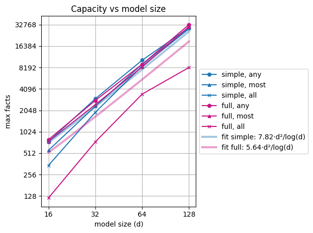
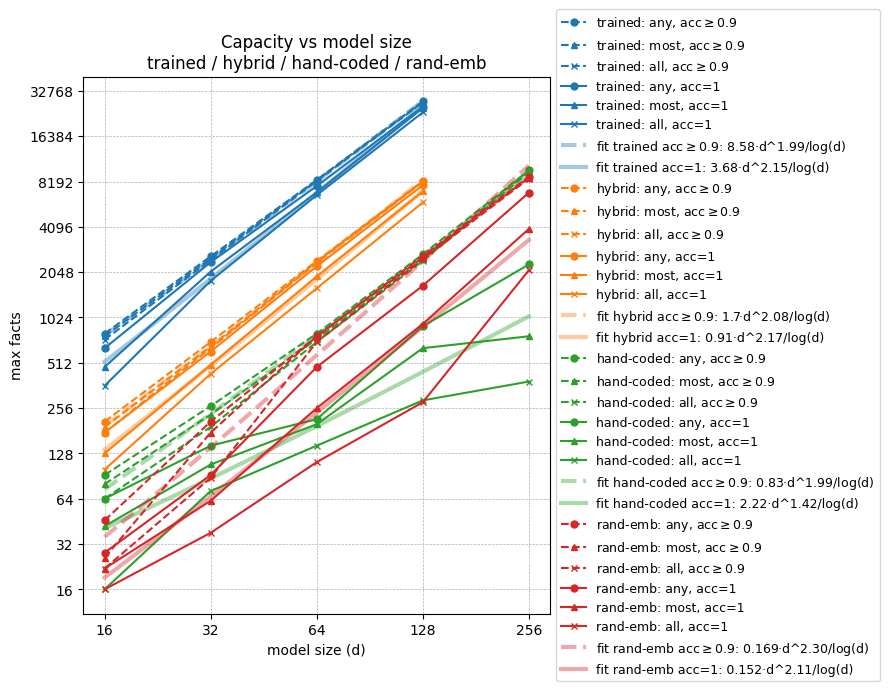

# Why sequence memorization
The goal of this research is to get a clearer understanding of how factual look-ups are encoded in LLMs.

I expect that a lot of the information stored in the weights of a LLM is memorized facts, rather than general circuits. I don't assume a clean separation between what is a "general circuit" vs a "memorized fact", but a clear example of the former is this [addition circuit](https://arxiv.org/abs/2605.01148), and a clear example of the latter is [knowing what sport some specific athlete is playing](https://www.lesswrong.com/s/hpWHhjvjn67LJ4xXX/p/iGuwZTHWb6DFY3sKB).

The goal of mech-interp is to be able to take a model (possibly together with its training data), and pick it apart into different components that do human understandable tasks. Since I expect that many of these tasks are factual look-ups, it would be useful to know what we should expect look-up to look like in a transformer model.

*Honorable mention:* One example of factual lookup (not studied in this post) is [bi-gram statistics, which is encoded in the embedding + unembedding matrices](https://transformer-circuits.pub/2021/framework/index.html#zero-layer-transformers). 

In this post, I study sequence memorization as a toy model for any factual lookup where some combination of multiple tokens carries a meaning that is substantially different from any linear combination of the individual tokens. 

# Outline
- **Training data** \
What is the task we are getting these models to perform

- **Testing Various Model Architectures** \
[section summary]

- **Scaling** \
[section summary]

- **Challenge: Benchmark for understanding** \
[section summary]

- **My attempt**\
My own attempt to solve the above challenge. 


# Training data

The training data are sequences of three tokens, two input tokens and one output token. Given an input of two tokens, the network is trained to predict the next token (i.e. the output token).

Hyperparameters for the data generation:

- input token vocabulary size
- output token vocabulary size

In my experiments, the input token vocabulary size is always twice the size of the output token vocabulary.[^1]

[^1]: I started out the experiments, having them the same size, but the network learned all the facts to easily, so I doubled the input vocabulary size in order to have more possible facts.

The code for generating the training data is not very long, and is quoted below if you prefer to read code

The inputs are

- `n_facts` -- Number of facts.
- `input_len` -- Number of input tokens. *This value is always 2.*
- `input_vocab_size`
- `output_vocab_size`
- `seed` -- Random seed. *This value is always 42.*[^2]

[^2]: I used a fixed random seed to avoid some runs getting lucky and getting easier facts, and to specifically have the same facts for trained networks and hand-coded networks. However this last aim failed because torch random functions give different results different when run on CPU vs GPU, even with the seed is the same. However, this probably isn't a significant concern.

The code first generates a list of every possible input combination. Then this list is shuffled, and the first `n_fact` pairs from the shuffled list are used as the inputs for the `n_fact` facts. These facts are then divided as equal as is possible among the `output_vocab_size` target labels.

*[Make a collapsible box for the code below]*

```python
def generate_facts(n_facts: int, # of facts to generate,
                   input_len: int, # number of input tokens per fact   
                   input_vocab_size: int, # of unique tokens in the vocabulary
                   output_vocab_size: int, # of unique targets
                   seed: int = 42
                  ) -> dict[str, torch.Tensor]:
    
    if n_facts > input_vocab_size ** input_len:
        raise ValueError(f"Cannot generate {n_facts} unique facts with a vocabulary of size {input_vocab_size} and input length {input_len}. Maximum unique facts: {input_vocab_size ** input_len}")
    
    device = torch.tensor(0).device  # respect default device
    generator = torch.Generator(device=device).manual_seed(seed)

    targets = torch.arange(n_facts) % output_vocab_size

    if input_len == 1:
        inputs = torch.randperm(input_vocab_size, generator=generator)[:n_facts].unsqueeze(1)
    elif input_len == 2:
        all_possible_inputs = torch.cartesian_prod(torch.arange(input_vocab_size), torch.arange(input_vocab_size))
        inputs = all_possible_inputs[torch.randperm(all_possible_inputs.size(0), generator=generator)[:n_facts]]
    else:
        inputs = torch.randint(0, input_vocab_size, (n_facts, input_len), generator=generator)

    sorted_indices = torch.argsort(targets)    
    return {"inputs": inputs[sorted_indices], "targets": targets[sorted_indices]}
```

# Testing Various Model Architectures

I want to learn how these facts would be learned by a one layer transformer. However, that turned out to be hard. But if I know in what part of the model the main action is, then maybe I can simplify the toy model to only that part and start with understanding that. 

To test what parts of the model are important for the sequence memorization task, I made a transformer model, where ever part of the model can be turned on or off. Then I trained all variants of this model and compared their performance.

The full toy model consist of:

- Token embeddings
- Positional embeddeings
- A single full width attention head
- A MLP layer (on the last token position only since I'm not trying to predict intermediate tokens)
- Two residual connections, one passed the attention, and one passed the MLP.
- Token unembedding to create the logits for the target tokens.
- Three RMS Norms, one applied to the input to the attention, one to the input to the MLP and one to the input to the unembedding.


*Figure 1: The full toy transformer model, with all the different parts present.*

After the attention, we only care about the computation in the second token position. This follows from the fact that we're only trying to predict the third token, and not the second token.

## Model variations

### Mixing
I want to be able to simplify the model by removing the attention. However, the problem with doing so is that the information from the first token has to reach the second token position somehow. Therefore, I can't just remove the attention, but will have to replace it with something else.

*Mixing* is the part of the model that combine the first token and second token information in to the same residual stream. I have three different variants for this.

- **Learned Attention (Lrn Attn):**
  Standard transformer attention. 

- **Uniform Attention (Unif Attn):**
  Same as above except I remove the attention pattern $\mathrm{softmax}(QK^\top)$ and replace it with a uniform $\frac{1}{2}$.

- **Dual Embedding (2Emb):**
  There is no attention and no positional embedding. Instead, there is two different token embeddings, one for each position. These are simply added together to make the first residual stream activation.


### MLP

There are a number of variants regarding the MLP. Firstly the MLP can either be present or be missing. Secondly if there is an MLP layer, each of the following can be varied

- **Activation Function (Act)** can be either GELU or ReLU
- **Bias** can exist or not.[^3]
- **Residual connection (Res)** around the MLP can exist or not.

[^3]: If the bias is present that means both the linear readout and the linear projection from the ReLU or GELU neurons, have bias. (Making them actually not linear functions but affine function, in strict math terminology.) If there is no bias, this means neither of these have bias. All other linear connections in the rest of the network (e.g. embeddings, etc) are always bias free.

### Norms

The norms can also be turned on and off. Each of the norms for the readin to the attention and MLP only exist if both that part of the network is present (Unif Attn or Lrn Attn for the attention), and Norms are turned on. The last norm, just before the unembedding only depends on the norm setting, and are there if norms are turned on and not there if norms are turned off.


*Figure 2: A simplified version of the toy model. The MLP is present but everything else (attention, norms, residual connection around the MLP) is turned off.*

## Results
The following is just a summary of the results. To see the full results, including the details of the experimental setup, see [Appendix A](link_ot_appendix_blogpos)

To find out which parts of the network matter for the memorization task, I trained every combination of the architectural variants described above, and measured the maximum number of facts each one could learn. All models in this experiment used the same size: $n_{input\_vocab} = 32$, $d_{residual} = 16$, $d_{MLP} = 16$, $n_{output\_vocab} = 16$.[^d16]

[^d16]: Initially I used dimension 16 for all these values, too many networks maxed out the number of possible facts, so I doubbled $n_{input\_vocab}$

The **MLP** is by far the most important part. 
- Adding the MLP block lets the network learn **60% - 373%** more facts, a much larger effect than any other setting. 
- The effect is ***largest*** when **Mixing** = **2Emb** or **Unif Attn**, combined with **Norms**=❌, I.e, when the MLP's ReLU or GELU neurons are the only non-linearity in the network.

**Mixing** is the second most influential setting, if there is an MLP.[^no_mlp]
- When **MLP**=❌ and **Norms**=❌ (nothing else in the netowrk than the mixing and the unembedding), then *all the mixing options does equally well*. 
- For all other settings **2Emb** *beats* **Unif Attn** (**7.8% - 39%** more facts), which *beats* **Lrn Attn** (**5% - 39%** more facts)

[^no_mlp]: In the absence of an MLP block, Norms is the second mores infuencial setting and Mixing beocomes the third. Although mixing only makes the third place becasue with no MLP there are no more settings.

Uniform attention being better than learned attention, has to be due to learned attention having training difficulties, since learned attention is strictly more expressive. Consistent with this, the learned attention results are also by far the least stable across repeated runs. It's not surprising that dual embedding is doing better than uniform attention, since it's both strictly more expressive, and should be no harder to train.

These results suggest that the attention probably isn't doing anything importantly different from just linearly adding together the embedding of the two tokens.[^att_do] 

[^att_do]: With some rotation added to the first token embedding as to be able to tell apart inputs with the two tokes swapped. E.g. to differentiate the input "1,2" from the input "2,1"

**Norms** is the third most influential setting, if there is an MLP.

- When **MLP**=✅ then adding norms lets the network learn **2.2% - 42%** more facts
- When **MLP**=❌ then adding norms lets the network learn **79% - 174%** more facts

**The remaining settings** matter less. 
 - **Res**=✅ is mostly better than **Res**=❌, with **-0.7%** to **34%** more facts
 - **Bias**=✅ is mostly better than **Bias**=❌, with **-5.1%** to **22%** more facts
 - **GELU** is mostly better than **ReLU**, with **-0.2%** to **13%** more facts

Finally, there is one notable outlier: the combination **MLP**=✅, **Norms**=✅, **Res**=❌, **Bias**=❌, **ReLU** (combined with **any Mixing** option) does far worse than the individual settings would predict — almost as bad as having no MLP at all. I don't know why.[^bad]

[^bad]: Just turning on the MLP bias or swiching from ReLU to GELU (changes that nomrally have small effects), is sufficien restore this architecutre to the normal capabilities range,


# Scaling
How do the number of learnable facts grow with model size? To find this out, I picked two of the very many model architecute varieties and sclade them up. 

These models are:
- ***Simple:*** See figure 1\
 **Mixing**=***2Emb***, **MLP**=✅, **Norm**=❌, **Res**=❌, **Bias**=❌ **Act**=**ReLU**

- ***Full:*** See Figure 2\
**Mixing**=***Lrn Attn***, **MLP**=✅, **Norm**=✅, **Res**=✅, **Bias**=✅ **Act**=**GELU** 


*Figure 3*

As you can see, the number of fact scales almost linearly with the number of weights in the model. The number of model weighs is proporional to $d^2$, while number of fact a network can learn scales as approximatly $d^{1.9}$. 

This is not surprising. ... something something log factor ... 


# Challenge: Benchmark for understanding

Can you or me, write down weights for the memory toy model, either by hand or some algorithm that isn't gradient descent, such that our resulting model match the performance of the learned model?

This challenge is a benchmark for how well we understand how the model store the facts. There are two reasons why this is a useful framing.

- If we understand how the facts are embedded, we should be able to replicate this, without gradient descent.
- Thinking about "How would I do this?" can be a useful framing for mech-interp.

I think that my current best attempt (which is presented further down) is some non-zero progress on this challenge, but there are still far to go. I encourage all readers give it a try yourself.

## Model architecture

Firstly, I'm not trying (yet) to produce weights for the full transformer model, but instead aiming to find functional weights for the simplified toy model shown in *Figure 2*.

Secondly, the version shown in *Figure 2* has unnecessarily many weights, which is a legacy from being a cut down version of the full version shown in *Figure 1*. Because the MLP is sandwich between two linear operations, I can skip the weight matrices of the MLP.

I can simplify it further down to this: 


*Figure 4: This model architecture is equivalent to the toy model configuration with settings Mixing=2Emb, MLP=✅, Norms=❌, Res=❌, Bias=❌, Act=ReLU.*

If you want to give the challenge a go, feel free to use this architecture, or any other that you find easier to work with. The final goal is to be able to write down functional weights for the full transformer model, but I think it's ok to start with a simpler case.

# My attempt

My algorithm has three steps

- Assign $S$ number ReLU neurons to each label. This means that each neuron will be assigned to several labels. These assignments should achieve both of: Each neuron should have approximately the same labels assigned to it as any other neuron; The max neuron overlap between any pair of labels, should be as small as possible.
- Choose the embedding weights such that each ReLU neuron assigned to label $l$ will output zero for all facts with label $l$.
- Assigned negative weights going from ReLU neurons assigned to label $l$, to the logit for $l$.
- Hyperparameter sweep: Repeat the above for different values of the construction's two hyperparameters, to find the best ones.

### Assigning neurons to labels
There are $d_{MLP}$ ReLU neurons, and $n_{output\_vocab}$ labels. Each label gets assigned $S\geq1$ neurons. In most of my experiments $d_{MLP}=n_{output\_vocab}$, which means for any $S>1$, the assignments will overlap.

One problem my network needs to solve is that there will likely be some pattern of facts
- $a,b$ -> $l$
- $c,d$ -> $l$
- $a,d$ -> not $l$

Any weight allocation, on this model architecture, where the logit for some label only depends on a single ReLU neuron, will fail at encoding this pattern. Therefore, the network either needs more ReLU neurons than labels (not realistic) or the labels will have to somehow share neurons, i.e. some sort of superposition encoding. 

I don't know a priori what is the best value of $S$, therefore $S$ is given as a hyperparameter, to search over later. Given $S$, $d_{MLP}$ and $n_{output\_vocab}$, I want to find an allocation where the allocations are spread out nicely. I.e. I want all neurons to be used by approximately the same number of labels, and I want to minimize the max neuron overlap between any pair of labels. 

I had Claude Code write the script that does this, and verified that the outputs look good. There are probably many ways to achieve similar allocations, and I can't think of any reason why the exact method matters, so I will not go into this further.

### Embedding weights
Next step is to make sure that any ReLU neurons always output zero on all facts with a label assigned to that neuron. 

The algorithm in broad strokes:

1. For each neuron, I list all facts with a label that is assigned to that neuron. 
2. For the first input token, I count how many times each token appear in this list of facts, I then take $top\_fraction$ of these input tokens and assign them the $weight = -1$, to that neuron.
3. Repeat step 2 for the second input token.
4. Find any fact that is not covered by step 2 and 3, and assign $weight = 0$ to both first and second input tokens for all such facts.
5. Assign $weight = 1$ to all remaining input tokens.


### Unembedding weights
The last step is simple. Each unembedding weight is $-1$ from ReLU neurons to labels assigned to that neuron, and $0$ everywhere else. 

I did also try assigning positive values everywhere else, but for the success criteria I use (looking at arg_max of the logits), adding these positive values makes no difference. I fist noticed this empirically, but it's also a mathematical fact.

### Hybrid model: Half hand-coded, half learned
Same as above except the unembedding weights are randomly initialized and trained.

### Hyperparameter search over S and top_fraction
When testing the capacity of this model design, I always to a hyperparameter search over $S$ and $top\_fraction$. 

For the hand-coded models the winning $S$ is typically $S\approx\sqrt{d}$ where $d$ is the model dimension. For hybrid models, this number is a bit smaller.

For the hand-coded models the winning $top\_fraction$ is typically in the range $0-0.28$. For the hybrid models the number is a bit larger.

See appendix B and C here [link] for details.

## Results
As to be expected, my hand-coded models are not as good as trained models, and it especially struggles to reach full accuracy. But if I accept 90% accuracy for the hand-coded model, it scales almost as well as the trained model, but with a worse pre-factor.

The plot below shows my data from binary search to find maximum number of fact a model can learn. 
- The model arcitecture is the one shown in Fig 3, for all models
- **trained**: All waigiths are lerned
- **hybrid**: Embedding weights are selected according to my algorithsm, and unembedding weights are trained.
- **hand-coded**: All weights are sellected according to my algorithm.
- **rand-emn**: Embedding weights are randomly initialised and frozen. Unembedding weights are trained.
- Training (when applicable) is done with Adam, lr=1e-2, up to 5000 with early stopping if max 100% acuracy is reached, or if accuracy has not inproved for 100 epochs. 
- All models are evaluated on accuracy, by which I mean percentage of facts it correctly predicts. This is calculated as $mean(argmax(logits)==labels)$
- **acc $\leq$ 0.9** means that an accuracy has to be at lease 90% for model to counts as successful
- **acc = 1** menas that accuracy has to be 100% for model to count as successful.
- Each experiment is run 11 times with the same facts but different random initialisations (for the trained models) or different random shuffles of neuron allocations, and different shufflings as tiebreaker in step 2 Embedding weights (for the hand-coded models). **any**/**most**/**all** indicate if the success criteria is that any most or all of the runs needs to reach the desired accuracy.
- Best fit lines are over aggregations of any/most/all.
- model size, $d$ is the dimension of the model. $n_{input\_vocab}=2d$, $d_{MLP}=d$, $n_{output\_vocab}=d$



*Figure 5*


