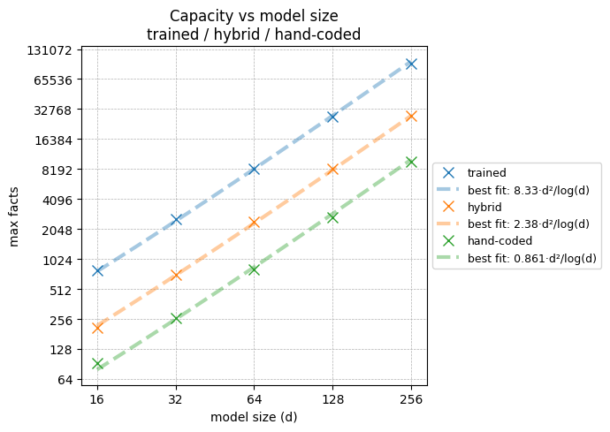

# [Challenge: Hand coding weights for efficient sequence memorisation]


We hand-coded weights for a one layer MLP that memorises labels for input token sequences of length two. The number of facts our hand-coded model can memorise with 90% accuracy[^90percent] scales roughly linearly with the model's parameter count[^log], just like trained models for the same architecture. However, our hand-coded model's scaling prefactor still falls short of the trained model's by a factor of $9.7$. A hybrid solution in which we handcode the MLP input weights and learn the MLP output weights, which amounts to a linear classification problem[^softmax], falls short by a factor of $3.5$.

[^log]: Up to a log factor that comes from larger output label dictionaries needing more bits to index.

[^90percent]: Meaning the model memorises the correct label for $\geq 90\%$ of the facts it is trained on.

[^softmax]: Not a trivial one though. We couldn't find an existing analytic solution for linear classification under softmax cross entropy loss, or linear classification under argmax.




*Figure 0: Max number of facts each model can learn when requiring 90% accuracy on evaluation. The fitted lines are best fit for $max\_facts=a\times d^2/\log(d)$ solving for $a$.*


**We pose a challenge to the community:** Find better constructions than ours that can memorise more facts in the same number of weights and close the gap to the trained solution further.[^other_construction]

[^other_construction]:Importantly, the MLP's hidden layer size $d$ here is smaller than the input token dictionary $n_{\text{input}\_\text{vocab}}$. For the case $d=n_{\text{input}\_\text{vocab}}+1$ (or $d=n_{\text{input}\_\text{vocab}}$ if we get output biases), we already have a more efficient construction, see Appendix A.


# Background: Why sequence memorization, and why an MLP?
The goal of this research is to get a clearer understanding of how look-ups are encoded in LLMs.

We expect that a lot of the information stored in the weights of an LLM is memorized facts,  rather than general circuits. We don't assume a clean separation between what is a "general circuit" vs a "memorized fact", but a clear example of the former is this [addition circuit](https://arxiv.org/abs/2605.01148), and a clear example of the latter is [knowing what sport some specific athlete is playing](https://www.lesswrong.com/s/hpWHhjvjn67LJ4xXX/p/iGuwZTHWb6DFY3sKB).

The goal of mech-interp is to be able to take a model (possibly together with its training data), and pick it apart into different components that do human-understandable tasks. Since we expect that many of these tasks are factual look-ups, it would be useful to know what we should expect look-up to look like in a transformer model.

Prior work already points at the MLP layers as the main storage site: [Geva et al.](https://arxiv.org/abs/2012.14913) describe transformer feed-forward layers as key-value memories, [Dai et al.](https://arxiv.org/abs/2104.08696) identify individual MLP neurons that control specific facts, [ROME](https://arxiv.org/abs/2202.05262) locates and edits factual associations in mid-layer MLPs, [MEMIT](https://arxiv.org/abs/2210.07229) inserts thousands of facts into mid-layer MLPs with closed-form weight updates, and [Allen-Zhu & Li](https://arxiv.org/abs/2404.05405) measure how many bits of knowledge a transformer can store per parameter. On the toy-model side, a recent theory line models transformer weight matrices as associative memories that store facts as sums of outer products: [Bietti et al.](https://arxiv.org/abs/2306.00802) for bigram lookups, [Cabannes et al.](https://arxiv.org/abs/2310.02984) for the capacity of linear memories over random embeddings (only $\sim d/\log d$ facts), and [Nichani et al.](https://arxiv.org/abs/2412.06538), who prove that one-layer transformers can store a number of facts linear in their parameter count, up to log factors.

None of this yet amounts to a weight-level account of *how* the storage in real models actually works. That's the level of understanding we're after.


In this post, we study sequence memorization as a toy model for any lookup where some combination of input signals carries a meaning that is substantially different from a linear combination of the individual signals.[^bigram]

Note that the kinds of sequences we consider here are deliberately structureless. Random input pairs are mapped to random labels, so there is nothing to compress. The model can do nothing except memorize.

We mostly focused for now on creating algorithms that memorise as much as possible, not yet on trying to understand how exactly the solutions trained models use work. The hope is that once we have any solution at all that performs somewhat similarly to the trained models', figuring out what exactly the trained models are doing might become a lot easier. That does mean that we focus on algorithms that qualitatively seem to us like they're not too far removed from something gradient descent methods might be able to learn.

[^bigram]: An even simpler example of lookup, not studied in this post, is [bi-gram statistics, which is (at least sometimes) encoded in the embedding + unembedding matrices](https://transformer-circuits.pub/2021/framework/index.html#zero-layer-transformers). Bi-grams don't need any token-combination machinery, which is why they can live entirely in the embedding/unembedding.


# Outline
- **Training data** \
In this section we describe the training data for the sequence memorization task: The model sees two input tokens and must predict one output label. The input→output mappings ("facts") are generated uniformly at random, so the model can only memorize them.


- **Testing Various Model Architectures** \
We take a one layer transformer, make every architectural component optional (attention, MLP, norms, residual connections, biases), train every variant, and measure the maximum number of facts each one can learn. Main findings: the MLP is by far the most important component, and replacing attention with a simple sum of per-position token embeddings works as well or better — in this task, attention seems to do nothing beyond linearly mixing the two tokens' information into one position.

- **Scaling** \
We scale up two variants: the full one layer transformer, and a heavily stripped-down variant (embeddings + ReLU neurons + unembedding). Both store a similar number of facts, scaling as roughly $\frac{d^{2}}{\log(d)}$ with model dimension, close to what we'd expect from a first principles information theory perspective. 

- **Challenge: Benchmark for understanding** \
Can you write down weights for the toy model by hand, or with any algorithm that isn't gradient descent, such that it matches the performance of a trained model? Being able to do this is a benchmark for how well we understand how the model stores facts. In this section we lay out the rules and evaluation criteria, and invite you to give it a try.


- **Our attempt**\
Our[^Lindas] attempt to solve the above challenge. When only 90% accuracy is required, our construction matches the trained models' scaling exponent, at roughly 9.8× fewer facts. At 100% accuracy it falls further behind as models grow. If we hand-code only the embedding matrix, learning the unembedding matrix with gradient descent amounts to a linear classification task. This boosts the number of facts we learn to roughly 3.6× fewer than the fully trained model, at both 90% and 100% accuracy thresholds. Non-zero progress, but much room for improvement. 

[^Lindas]: **Lucius:** Well, Linda's attempt, really.


# Training data

The training data are sequences of three tokens, two input tokens and one output token. Given an input of two tokens, the network is trained to predict the next token (i.e. the output token).

The code for generating the training data is not very long, and is quoted below in full, if you prefer to read code.

Hyperparameters for the data generation:

- `n_facts` -- Number of facts.
- `input_vocab_size`
- `output_vocab_size`
- `seed` -- Random seed. *This value is always 42 in our experiments.*[^2]

The code first generates a list of every possible input combination. Then this list is shuffled, and the first `n_facts` pairs from the shuffled list are used as the inputs for the `n_facts` facts. These facts are then divided as equally as possible among the `output_vocab_size` target labels.


[^2]: We used a fixed random seed when generating facts in order to avoid some runs getting lucky and getting easier facts, and to specifically have the same facts for trained networks and hand-coded networks. The last part kind of failed because torch random functions give different results when run on CPU vs GPU, even when the seed is the same.

*[Make a collapsible box for the code below]*

```python
def generate_facts(n_facts: int, # of facts to generate, 
                   input_vocab_size: int, # of unique tokens in the vocabulary
                   output_vocab_size: int, # of unique targets
                   seed: int = 42
                  ) -> dict[str, torch.Tensor]:
    
    if n_facts > input_vocab_size ** 2:
        raise ValueError(f"Cannot generate {n_facts} unique facts with a vocabulary of size {input_vocab_size}. Maximum unique facts: {input_vocab_size ** 2}")
    
    device = torch.tensor(0).device  # respect default device
    generator = torch.Generator(device=device).manual_seed(seed)

    all_possible_inputs = torch.cartesian_prod(torch.arange(input_vocab_size),
                                               torch.arange(input_vocab_size))

    inputs = all_possible_inputs[torch.randperm(all_possible_inputs.size(0),
                                                generator=generator)[:n_facts]]
    
    targets = torch.arange(n_facts) % output_vocab_size
    sorted_indices = torch.argsort(targets)    

    return {"inputs": inputs[sorted_indices], 
            "targets": targets[sorted_indices]}
```

# Testing Various Model Architectures

We want to find out how these facts can be encoded in a one layer transformer. However, that turned out to be hard. But if we know in what part of the model the main action is, then maybe we can simplify the toy model to only that part and start with understanding that. 

To test what parts of the model are important for the sequence memorization task, we made a transformer model, where every part of the model can be turned on or off. Then we trained all variants of this model and compared their performance.

The full toy model consists of:

- Token embeddings
- Positional embeddings
- A single full width attention head
- An MLP layer (on the last token position only since we're not trying to predict intermediate tokens)
- Two residual connections, one past the attention, and one past the MLP.
- Token unembedding to create the logits for the target tokens.
- Three RMS Norms, one applied to the input to the attention, one to the input to the MLP and one to the input to the unembedding.


*Figure 1: The full toy transformer model, with all the different parts present.*

After the attention, the model only continues its computation in the second token position. This is because the model is only trying to predict the third token, and not the second token.

## Model variations

### Mixing
We want to be able to simplify the model by removing the attention. However, the problem with doing so is that the information from the first token has to reach the second token position somehow. Therefore, we can't just remove the attention, but will have to replace it with something else.

*Mixing* is the part of the model that combines the first token and second token information into the same residual stream. We have three different variants for this.

- **Learned Attention (Lrn Attn):**
  Standard transformer attention. 

- **Uniform Attention (Unif Attn):**
  Same as above except we remove the attention pattern $\mathrm{softmax}(QK^\top)$ and replace it with a uniform $\frac{1}{2}$.[^suggested]

- **Dual Embedding (2Emb):**
  There is no attention and no positional embedding. Instead, there are two different token embeddings, one for each position. These are simply added together to make the initial residual stream activation.

[^suggested]: Thanks to Nico Penttilä and Mikhail Doroshenko for suggesting this variant.

### MLP

There are a number of variants regarding the MLP. Firstly the MLP can either be present or be missing. Secondly if there is an MLP layer, each of the following can be varied

- **Activation Function (Act)** can be either GELU or ReLU.
- **Bias** can be included or not.[^3]
- **Residual connection (Res)** around the MLP can exist or not.

[^3]: If the bias is included, that means both the linear projection into and the linear projection out of the ReLU/GELU neurons get a bias. (Making them actually not linear functions but affine functions, in strict math terminology.) If the bias is not included, this means neither of them get a bias. All other linear connections in the rest of the network (e.g. embeddings, etc) are always bias-free.

### Norms

The norms can also be turned on and off. Each of the norms for the read-in to the attention and MLP only exists if both that part of the network is present (Unif Attn or Lrn Attn for the attention), and Norms are turned on. The last norm, just before the unembedding only depends on the norm setting, and is there if norms are turned on and not there if norms are turned off.


*Figure 2: A simplified version of the toy model. The MLP is present but everything else (attention, norms, residual connection around the MLP) is turned off.*

## Results
The following is just a summary of the results. To see the full results, including the details of the experimental setup, see Appendix B.

To find out which parts of the network matter for the memorization task, we trained every combination of the architectural variants described above, and measured the maximum number of facts each one could learn. All models in this experiment used the same size: $n_{\text{input}\_\text{vocab}} = 32$, $d_{residual} = 16$, $d_{MLP} = 16$, $n_{\text{output}\_\text{vocab}} = 16$.[^d16]

[^d16]: Initially $n_{input\_vocab}$ was the same as all the other values, but too many networks maxed out the number of possible facts, so we doubled $n_{input\_vocab}$

The networks are trained using gradient descent[^Adam], on a cross entropy loss. We say that they have successfully learned some number of facts if, at the end of training, taking argmax over the logits always gives the correct label. To find the maximum learnable facts for a specific architecture variant, we do a binary search over the number of facts.

Note that this is measuring the maximum number of facts *that Adam can find weights for*, not how many facts an architecture can represent in theory. So, some of the observed effects below (definitely the learned-attention results, possibly also the norm results) are likely about trainability rather than architectural capacity.

[^Adam]: Adam to be specific, with the following learning rate schedule: We start out with lr=1e-2, and train for either 50000 epochs or until accuracy [defined as $mean(argmax(logits)==labels)$] has not improved for 5000 epochs. If at the end of this accuracy is below 1 but above 0.95, we continue the training with lr dropped to 3e-3 and same stopping criteria, and finally repeat for lr=1e-3. Training also ends if the accuracy=1 is reached.

In the bullets below, percentage ranges like "X% - Y% more facts" give the range of the effect of one setting across all combinations of the other settings. For absolute numbers see table B.1 in Appendix B.

The **MLP** is by far the most important part. 
- Adding the MLP block lets the network learn **60% - 373%** more facts, a much larger effect than any other setting. 
- The effect is ***largest*** when **Mixing** = **2Emb** or **Unif Attn**, combined with **Norms**=❌, I.e, when the MLP's ReLU or GELU neurons are the only non-linearity in the network.

**Mixing** is the second or third most influential setting.[^no_mlp]
- For most settings **2Emb** *beats* **Unif Attn** (**7.8% - 39%** more facts), which *beats* **Lrn Attn** (**5% - 39%** more facts)
- Except when **MLP**=❌ and **Norms**=❌ (nothing else in the network besides the mixing and the unembedding), then *all the mixing options do equally well*. 

[^no_mlp]: If there is an MLP block then Mixing is generally more important than norms, and the other way round without the MLP.  

Uniform attention being better than learned attention has to be due to learned attention having training difficulties, since learned attention is strictly more expressive. Consistent with this, the learned attention results are also by far the least stable across repeated runs. It's not surprising that dual embedding does better than uniform attention, since it's both strictly more expressive[^expressivity] and should be no harder to train.

[^expressivity]: Strictly more expressive because: with uniform attention, the residual stream at the second position is $E(t_1)\frac{W_{OV}}{2} + E(t_2)(\frac{W_{OV}}{2} + I)$ plus positional terms: Two per-position linear maps that are constrained to share the same embedding matrix $E$. 2Emb replaces these with two fully independent matrices, so it can represent anything uniform attention can, and more.

These results suggest that the attention probably isn't doing anything importantly different from just linearly adding together the embeddings of the two tokens.[^att_do] 

[^att_do]: With some rotation added to the first token embedding so as to be able to tell apart inputs with the two tokens swapped, e.g. to differentiate the input "1,2" from the input "2,1".

**Norms** is the second or third most influential setting.[^no_mlp]

- When **MLP**=✅ then adding norms lets the network learn **2.2% - 42%** more facts
- When **MLP**=❌ then adding norms lets the network learn **79% - 174%** more facts

**The remaining settings** matter less. 
 - **Res**=✅ is mostly better than **Res**=❌, with **-0.7%** to **34%** more facts
 - **Bias**=✅ is mostly better than **Bias**=❌, with **-5.1%** to **22%** more facts
 - **GELU** is mostly better than **ReLU**, with **-0.2%** to **13%** more facts

Finally, there is one notable outlier: the combination **MLP**=✅, **Norms**=✅, **Res**=❌, **Bias**=❌, **ReLU** (combined with **any Mixing** option) does far worse than the individual settings would predict, almost as bad as having no MLP at all.[^bad] We don't know why.

[^bad]: Just turning off the norms or turning on the MLP bias or switching from ReLU to GELU (changes that normally have small effects) is sufficient to restore this architecture to the normal capabilities range.


# Scaling

How does the number of learnable facts grow with model size? To find this out, we picked two of the very many model architecture varieties and scaled them up. 

These models are:

- ***Full:*** See Figure 1\
**Mixing**=***Lrn Attn***, **MLP**=✅, **Norms**=✅, **Res**=✅, **Bias**=✅, **Act**=**GELU**

- ***Simple:*** See Figure 2\
 **Mixing**=***2Emb***, **MLP**=✅, **Norm**=❌, **Res**=❌, **Bias**=❌, **Act**=**ReLU**


We test how many facts each of these models can learn for a range of model dimensions $d$ with
* $n_{\text{input}\_\text{vocab}} = 2d$, [^d16]
* $d_{residual} = d$, 
* $d_{MLP} = d$, 
* $n_{\text{output}\_\text{vocab}} = d$.


And the result is


*Figure 3: Maximum number of facts a network can learn vs model dimension.*


The number of facts each model can learn scales roughly as $\frac{d^{2}}{\log(d)}$. This is basically what we'd expect a priori from an information theory perspective, because the number of bits in the model's parameters scales with $d^2$. The number of bits required to store a label scales with $\log(n_{\text{output}\_\text{vocab}}) = \log(d)$.


# Challenge: Benchmark for understanding

Can we write down weights for the sequence memorization toy model, either by hand or with some algorithm that isn't raw numeric optimisation à la gradient descent, such that the resulting model matches the performance of a trained model?

Ultimately we also want this algorithm to yield weights and neuron activations qualitatively similar to those real models produce, but for now we're mostly focusing on raw performance.

There are two reasons why this is a useful framing.

- If we understand how the facts are embedded, we should be able to replicate this, without gradient descent.
- Thinking about "How would I do this?" can be a useful framing for figuring out what some trained model is doing.


We think that our current best attempt (which is presented further down) is some non-zero progress on this challenge, but there is still far to go. We encourage all readers to give it a try.

## Rules
* Use the model architecture described below. [^rule_one]
* Use the code in section "Training data" to generate facts.
* Come up with an algorithm that generates the model weights, if given a list of facts to encode. 
* You can't produce the weights with gradient descent, or with any other generic black-box optimizer.[^hybrid_rule] Closed-form computations, greedy algorithms, and combinatorial constructions are all fine. For example, a ridge regression would be allowed. The spirit of the rule is that the algorithm should embody an explanation of *how* the facts get stored, not merely find weights that happen to work.
* You can do a hyperparameter sweep over hyperparameters in your algorithm.
* Evaluate your models using the evaluation criteria below.

[^rule_one]: That is, if you want to be able to compare your results with ours. But if you make progress on this challenge using some other architecture, we'd be interested in that too. Just make sure to include something like an MLP layer, since that is where most of the sequence memorization capacity lives in the trained models. 

[^hybrid_rule]: Except for the hybrid condition where you can use gradient descent-esque methods for the unembedding weights. See "Evaluation Criteria".

## Model architecture
Most of the sequence memorization capacity is in the MLP. We therefore propose focusing on a toy model with only this part and everything else cut out. This would be something like the *simple* model in the previous scaling experiment (Figure 2). However, that architecture still has unnecessarily many weights, a legacy of being a cut-down version of the full model in Figure 1: the MLP's input matrix sits directly after the embeddings, and its output matrix directly before the unembedding. Two consecutive linear maps can always be folded into one, so we absorb $W_{in}$ into the two embedding matrices and $W_{out}$ into the unembedding, with no loss of expressivity. Doing so gives us this architecture:


*Figure 4: This model architecture is equivalent to the toy model configuration with settings Mixing=2Emb, MLP=✅, Norms=❌, Res=❌, Bias=❌, Act=ReLU.*

Use this architecture for the challenge if you want to be able to compare your results with ours. However, if you want to go for something slightly different, or even the full 1-layer transformer, we'd still be interested in what you can do.

Note that in our model architecture, **the MLP's hidden dimension $d$ is always scaled to stay smaller than the input vocabulary $n_{\text{input}\_\text{vocab}}$**, and this seems somewhat load-bearing. For the case $d=n_{\text{input}\_\text{vocab}}+1$, we already have a more efficient construction which we think probably gets pretty close to the theoretical capacity limit, though it doesn't seem like something a model is likely to learn in training. See Appendix A for that construction.

## Evaluation Criteria

* **Max facts, acc=1** \
What is the maximum number of facts you can give the model such that argmax of the output logits gives the correct labels for every fact.

* **Max facts, acc >= 0.9**\
Same as above except argmax of the output logits only needs to give the correct labels on 90% of the facts.

* **Hybrid**\
Same evaluation criterion as either of the above. However, your algorithm only has to generate the embedding matrix; the unembedding is trained. 

For each of the four criteria,[^four] see how the maximum number of facts scales with model size. 

* Can you get the same scaling exponent as fully trained models?
* Can you get the same pre-factor (or close to) as the fully trained models?
* Can you do better than us on either of the above?

[^four]: There are four combinations:
 * acc = 1
 * acc >= 0.9
 * hybrid, acc = 1, 
 * hybrid, acc >= 0.9
 
 [The above list should be in the footnote. If it doesn't work here, I'll fix it on LW.]
 

## How this challenge relates to known constructions

Hand-coded memorization has a long history in learning theory: [Baum (1988)](https://www.sciencedirect.com/science/article/pii/0885064X88900209) memorizes $N$ binary-labeled points in *general position*[^general_position] in $\mathbb{R}^k$ with $\lceil N/k \rceil$ hidden threshold units, [Bubeck et al.](https://arxiv.org/abs/2006.02855) give a ReLU version of Baum's construction with near-optimal weight magnitudes,  [Yun et al.](https://arxiv.org/abs/1810.07770) prove a one-hidden-layer ReLU net can memorize a general-position $c$-class dataset if its width is at least $4N/k + 4c$, and [Vardi et al.](https://arxiv.org/abs/2110.03187) memorize $N$ points with $\tilde{O}(\sqrt{N})$ parameters, though only via depth $\sim\sqrt{N}$ networks whose weights each also need to carry $\tilde{\Theta}(\sqrt{N})$ bits. None of these results transfer here: they need at least one and often multiple of neuron count greater than $n_{\text{input}\_\text{vocab}}$ [^appendixconstruction], multiple hidden layers, or inputs that are in general position[^general_position], which token sequences are not.

[^general_position]: Meaning no k+1 of the points lie on a common affine hyperplane. 


[^appendixconstruction]: See the appendix for our much less 'realistic' but much more efficient storage construction in the easier $d=n_{\text{input}\_\text{vocab}}+1$ setting.

Just before publishing this, we actually found one construction in the literature that seems promising: [Dugan et al.](https://arxiv.org/abs/2512.00207). They give a weight construction for gated one-hidden-layer MLPs $D\,(\sigma(Gx)\odot Ax)$. The gating weights $G$ are chosen at random. The requirement that every key hit its target output (margin-optimal label directions, compressed to roughly $\log(n_{\text{output}\_\text{vocab}})$ dimensions with a random projection that the output matrix then undoes) then becomes a linear system in the entries of the up-projection matrix $A$, which they solve exactly. 

We have some preliminary results for adapting this construction to our setting that indicate it performs better than our current hand-coded solution or even our hybrid solution, though it still falls well short of the trained one. The reason we haven't switched over to their construction yet is that it seems to us very unlike something models trained with gradient descent would or could learn. A bit like our own construction in Appendix A. We do ultimately want to reverse engineer trained models, getting storage efficiency up is just a stepping stone for that. Nevertheless, adapting this construction would be a valid challenge entry and we'd probably have included an adaptation of their algorithm in this post if we'd found it earlier.


# Our attempt

This is our[^Lindas] attempt at solving the challenge we proposed above. Below we present first our algorithm, and then how it performed relative to trained models.

- At **acc ≥ 0.9**, our fully hand-coded models scale almost as well as the trained models (fitted exponent 1.93 vs 1.97), but with a worse prefactor.
- At **acc = 1**, the hand-coded models fall further behind as models grow: about 27× fewer facts than trained models at $d=128$, with the gap widening.
- The **hybrid** models (hand-coded embeddings, trained unembedding) scale about as well as the fully trained solution for both acc ≥ 0.9 and acc = 1 (fitted exponents 2.04, 2.09 vs. 1.97, 2.04).


You can find the code for our construction [here](https://github.com/LindaLinsefors/Memory-Toy-Models/blob/master/hand_coded_models/hc2.py).[^repo]

[^repo]: I (Linda) cleaned this one file in the repo. Everything else there is a mess. I don't recommend trying to read any other file.

## Algorithm: Summary
First we associate each label with a unique set of neurons.[^neuron_set] These neurons will somehow identify facts with this label. 

[^neuron_set]: To clarify: Typically each neuron will be used by multiple labels, but no two labels share all their neurons.

It would be great if, given a fact with label $l$, all the neurons associated with label $l$ were active, and no other neurons are active. However for most sets of facts, this will not be possible.[^xor]

[^xor]: Given some set of facts (i.e. all the facts with label $l$, or all the facts associated with any label that is associated with neuron $n$), you typically can't decide that some neuron $n$ will be active (or inactive) for only that set of facts, and no others. That's only possible if the inputs to those facts are linearly separable, which is typically not the case. 

An alternative, which is less ideal, but has the significant advantage of being possible, is to set up the embedding weights such that, for any input fact with any label $l$, all neurons associated with $l$ will be active. Some additional neurons will also be active, but not all of them. With some skill and some luck, none of the wrong labels will have all their neurons activated.

However, there is one more problem. "Active" isn't a single number. Even if the correct label has all its neurons active, and none of the incorrect labels has all of their neurons active, an incorrect label can still have higher overall activation, if that label's neurons activate more strongly. One way to solve this is to make sure all active neurons have the exact same value, but that would add an unnecessary constraint. A better solution is to flip the script, and make sure that all neurons associated with label $l$ are *inactive* for any fact with label $l$. This exploits the one place where a ReLU network gives us exact equality for free: every negative pre-activation is mapped to exactly zero. "All of this label's neurons are inactive" is therefore a condition the readout can check exactly, by giving those neurons negative weight into the label's logit and checking for a logit of exactly zero.

In summary:
* Assign a unique set of neurons to each label.
* Choose the embedding weights such that, for every label $l$, and every fact with label $l$, all pre-activations will be less than or equal to zero, for every neuron associated with label $l$.
* Under the above constraint, try to make as many pre-activations as possible be above zero.
* For every label $l$, assign a constant negative weight between the logit for $l$ and every neuron associated with $l$. Let all other unembedding weights be zero. 

## Algorithm: More details
Our algorithm for assigning weight matrix values has these steps:

- Assign $S$ ReLU neurons to each label. This means that each neuron will be assigned to several labels. These assignments should achieve both of: each neuron should have approximately the same number of labels assigned to it as any other neuron; the max neuron overlap between any pair of labels should be as small as possible.
- Choose the embedding weights such that each ReLU neuron assigned to label $l$ will output zero for all facts with label $l$.
- Assign negative weights going from ReLU neurons assigned to label $l$, to the logit for $l$.
- Hyperparameter sweep: Repeat the above for different values of the construction's two hyperparameters, to find the best ones.

### Assigning neurons to labels
There are $d_{MLP}$ ReLU neurons, and $n_{\text{output}\_\text{vocab}}$ labels. Each label gets assigned $S\geq1$ neurons. In most of our experiments $d_{MLP}=n_{\text{output}\_\text{vocab}}$, which means for any $S>1$, the assignments will overlap.

One problem our network needs to solve is that there will likely be some pattern of facts
- $x,z$ -> $l$
- $p,q$ -> $l$
- $x,q$ -> not $l$
- $p,z$ -> not $l$

Any weight allocation, on this model architecture, where the logit for some label only depends on a single ReLU neuron, will fail at encoding this pattern. Therefore, the network either needs more ReLU neurons than labels (not realistic) or the labels will have to somehow share neurons, i.e. some sort of [superposition](https://transformer-circuits.pub/2022/toy_model/index.html) encoding. 

We don't know a priori what the best value of $S$ is, so $S$ is given as a hyperparameter, to search over later. Given $S$, $d_{MLP}$ and $n_{output\_vocab}$, we want to find an allocation where the assignments are spread out nicely. I.e. we want all neurons to be used by approximately the same number of labels, and we want to minimize the max neuron overlap between any pair of labels. 

We had Claude Code write the script that does this, and verified that the outputs look good. There are probably many ways to achieve similar allocations, and we can't think of any reason why the exact method matters, so we will not go into this further. If you want to look into the details, see [the code](https://github.com/LindaLinsefors/Memory-Toy-Models/blob/master/hand_coded_models/hc2.py).[^repo]

### Embedding weights
The next step is to make sure that every ReLU neuron always output zero on all facts with a label assigned to that neuron. Recall that in this architecture (Figure 4), the embedding weights map input tokens directly to neuron pre-activations, so "embedding weight" below means the weight from a token (at position one or two) to a neuron.

In broad strokes, our algorithm for each neuron is:

1. We list all facts with a label that is assigned to that neuron. 
2. For the first input token, we count how many times each token appears in the list of facts, take the $top\_fraction$ most frequent of these input tokens and assign them $weight = -1$ for that neuron.
3. Repeat step 2 for the second input token.
4. Find any facts in the list where neither token got a weight of -1 in step 2 or 3, and assign $weight = 0$ to both of that fact's input tokens.
5. Assign $weight = 1$ to all remaining input tokens.


### Unembedding weights
We set the unembedding weights between each label and its assigned neurons to $-2$[^minus]. We set all other unembedding weights to $0$. 

[^minus]: This could have been any negative number, and it would work equally well. It just happens to be -2 in the code.

We did also try assigning positive values everywhere else, but for the success criterion we use (looking at argmax of the logits), adding these positive values makes no difference. We first noticed this empirically, but it's also a mathematical fact.

### Hybrid model: Half hand-coded, half learned
Same as above except the unembedding weights are randomly initialized and then trained.

### Hyperparameter search over S and top_fraction
When testing the capacity of this model design, we always do a hyperparameter search over $S$ and $top\_fraction$. 

For the hand-coded models the winning $S$ is typically $S\approx\sqrt{d}$ where $d$ is the model dimension. For hybrid models, this number is a bit smaller.

For the hand-coded models the winning $top\_fraction$ is typically in the range $0-0.28$. For the hybrid models the number is a bit larger.

See Appendix C and D for details.


## Results
The plot below shows our data from binary search to find the maximum number of facts a model can learn. 
- The model architecture is the one shown in Fig 4, for all models.
- **trained**: All weights are learned.
- **hybrid**: Embedding weights are selected according to our algorithm, and unembedding weights are trained.
- **hand-coded**: All weights are selected according to our algorithm.
- **rand-emb**: Embedding weights are randomly initialized and frozen. Unembedding weights are trained.[^rand-emb]
- Training (when applicable) is done with Adam, lr=1e-2, up to 5000 epochs with early stopping if 100% accuracy is reached, or if accuracy has not improved for 100 epochs. 
- All models are evaluated on accuracy, by which we mean percentage of facts the model correctly predicts. This is calculated as $mean(argmax(logits)==labels)$.
- **acc $\geq$ 0.9** means that the accuracy has to be at least 90% for the model to count as successful.
- **acc = 1** means that accuracy has to be 100% for the model to count as successful.
- $d$ is the size of the model. $n_{input\_vocab}=2d$, $d_{MLP}=d$, $n_{output\_vocab}=d.$[^d16]

[^rand-emb]: The embedding matrix weights are drawn from a uniform distribution centered on zero. Specifically it's uniform over $[-\frac{1}{\sqrt{n_{input\_vocab}}} , \frac{1}{\sqrt{n_{input\_vocab}}}]$. However, the scale should not matter, since that can be compensated for by the unembedding weights.


*Figure 5*

The best-fit lines from Figure 5:[^not_serious]

[^not_serious]: Note that the prefactors here are a little different from the ones in Figure 0 because we're fitting both the prefactors and the exponents to confirm which exponents seem close to the desired $2.0$. Any exponents $>2.0$ also shouldn't be taken too seriously. They're either noise in the fit or ought to vanish at large enough $d$.

| Condition | acc = 1 | acc ≥ 0.9 |
|---|---|---|
| trained | $4.94 \cdot d^{2.10} /\log(d)$ | $9.09 \cdot d^{1.98} /\log(d)$ |
| hybrid | $1.56 \cdot d^{2.07}/\log(d)$ | $2.20 \cdot d^{2.02} /\log(d)$ |
| hand-coded |$2.17 \cdot d^{1.55} /\log(d)$ | $1.16 \cdot d^{1.93} /\log(d)$|
| rand-emb | $0.151 \cdot d^{2.24} /\log(d)$ | $0.278 \cdot d^{2.21} /\log(d)$ |

## Takeaways

- We match the trained model's scaling behaviour for acc=0.9, though with a worse prefactor
- For acc=1.0 we don't scale as well as the trained model, which indicates there's probably some kind of flaw in our algorithm.
- The hybrid model that trains only the unembedding matrix significantly outperforms the rand-emb model, indicating that our embedding matrix works a lot better than these random uniform weights. However, the random uniform matrix has a scaling exponent somewhat notably larger than $2.0$, indicating that it might get less inefficient at larger scales.
- The hybrid model also significantly outperforms our hand-coded model, indicating there's some room left to improve our construction with a better unembedding matrix. We think designing good unembedding matrices is probably easier than embedding matrices, since it's mostly just a sort of linear classification problem. So there's maybe some low-hanging fruit left to pick to improve our construction here.

## Do the matrices look similar?

There might be multiple different algorithms to achieve high memorisation capacity, so even if we match the trained model's performance that doesn't necessarily mean we understand how the trained model works yet, though we think it'd be a good intermediate result. That said, how close do the weight matrices our algorithm constructs look to the trained weight matrices?


The first row shows our hand coded weights. The second and third rows are weights for models trained on the same number of facts as the hand-coded ones, and as many as they can fit respectively.

Some surface-level observations: Our embedding weights only take three different values, 1, 0 or -1. The network's weights are more smeared out, though the ones in the second row are quite trimodal, with one narrow cluster at zero and two broader clusters of positive and negative weights. The weights in the third row are much more spread out. They could maybe be three broad peaks grown together?[^scale]

The unembedding is pretty different even in the second row, with our hand-coded weights being bimodal whereas the trained weights are trimodal again, with a small peak at zero and big positive and negative peaks. 


For the neurons, while our hand-coded algorithm stores facts as patterns of inactive neurons, trained models seem to use patterns of active neurons instead. Maybe as a result of that, the proportions of positive vs. zero activations appear to be somewhat flipped. The trained models' neuron activations are also more smeared out and gradual than ours, as one would expect from their more smeared out embedding weights.


[^scale]: The absolute scale of the weights doesn't matter that much because ReLUs are scale invariant.

# Contributions and acknowledgements
Linda did most of the work. Lucius gave advice and encouragement, came up with the alternative construction in Appendix A, and helped write and edit the post.

Linda is supported by a grant from Coefficient Giving. Lucius works at Goodfire AI.


# Appendix A: Near-optimal construction for $d_{MLP} = n_{\text{input}\_\text{vocab}}+1$

Throughout the main text the hidden width $d_{MLP}$ is scaled to stay *below* the input vocabulary size (we use $n_{\text{input}\_\text{vocab}} = 2d$). This appendix treats the boundary case just past that constraint. The hidden layer is given one neuron more than the input vocabulary size, $d_{MLP} = n_{\text{input}\_\text{vocab}}+1$. In this case a hand-coded construction can store all $n_{\text{input}\_\text{vocab}}^2$ possible facts with 100% accuracy. It uses the same architecture as Figure 4 (two embedding matrices, one ReLU layer, an unembedding; no norms, residuals, or bias terms[^bias_swap]).

This algorithm does seem qualitatively very unlike the ones trained models learn, with only two active neurons per fact. So it might be a bit of a dead end. We nevertheless include it in case there are ways to adapt ideas from it for future constructions.


[^bias_swap]: If we have output biases, we can adjust the construction to only need $d=n_{\text{input}\_\text{vocab}}$.

Let $L[a,b] \in \{0,\dots,n_{\text{output}\_\text{vocab}}-1\}$ be the label of the fact with input $(a,b)$.

The first $0,\dots,n_{\text{input}\_\text{vocab}}-1$ neurons will be **selector neurons**, with neuron $i$ switching on only if first-position token $i$ is active, and the final neuron is an always-on bias. The weights are:

$$E_1[a,i] = \begin{cases} 0 & i = a \quad(\text{token } a\text{'s selector}) \\ -n_{\text{output}\_\text{vocab}} & i < n_{\text{input}\_\text{vocab}},\ i \ne a \\ \tfrac{1}{2} & i = n_{\text{input}\_\text{vocab}} \end{cases}$$

$$E_2[b,i] = \begin{cases} L[i,b]+1 & i < n_{\text{input}\_\text{vocab}} \\ \tfrac{1}{2} & i = n_{\text{input}\_\text{vocab}} \end{cases}$$

$$W_U[c,i] = \begin{cases} c+1 & i < n_{\text{input}\_\text{vocab}} \\ -\tfrac{(c+1)^2}{2} & i = n_{\text{input}\_\text{vocab}} \end{cases}$$

The overall scale of $W_U$ is free: multiplying it by any positive constant leaves the argmax unchanged but makes the softmax arbitrarily confident in the correct label.

In words: the first token uses the large negative weight $-n_{\text{output}\_\text{vocab}}$ to switch every selector neuron except the one it is assigned to off. The second token's embedding then writes the fact's label (shifted up by one) into that surviving selector neuron as its activation value. The $+1$ shift keeps the value positive, so that a label of $0$ is distinguishable from a silent neuron. The bias neuron is wired to be permanently on and supplies the per-class thresholds that are required to read the labels out linearly (which is why we cannot fold it away in a bias-free architecture, and why we need the extra neuron).

**How it works.** Take the fact $(5,7)\to 8$. On input $(5,7)$, selector neuron $5$ has pre-activation $0 + (L[5,7]+1) = 9$ and fires with value $9$; every other selector neuron $i$ has pre-activation $-n_{\text{output}\_\text{vocab}} + (L[i,7]+1) \le 0$ and stays silent; the bias neuron is $1$. In general, writing $\ell = L[a,b]$,

$$z_i = \mathrm{ReLU}\big(E_1[a,i]+E_2[b,i]\big) = \begin{cases} \ell+1 & i = a \\ 0 & i < n_{\text{input}\_\text{vocab}},\ i \ne a \\ 1 & i = n_{\text{input}\_\text{vocab}} \end{cases}$$

$$\mathrm{logit}_c = \sum_{i} W_U[c,i]\,z_i = (c+1)(\ell+1) - \tfrac{(c+1)^2}{2} = -\tfrac{1}{2}(c-\ell)^2 + \tfrac{(\ell+1)^2}{2}$$

$$\Rightarrow \arg\max_{c}\ \mathrm{logit}_c = \ell.$$

The bias neuron's output weights $-\tfrac{(c+1)^2}{2}$ make the activations for different labels linearly separable. The labels $c$ with $c+1$ closest to the neuron's activation value then always gets the highest logit. This holds for every one of the $n_{\text{input}\_\text{vocab}}^2$ pairs, so any set of up to $n_{\text{input}\_\text{vocab}}^2$ possible facts is memorized perfectly.


# Appendix B: More on what parts of the model matter


The point of this experiment is to figure out which parts of the network are important for the sequence memorization task, so that we know which parts are safe to ignore or even remove, in order to make understanding the model easier.

What we found was that having an MLP is the most important part (approximately responsible for learning half of the facts), and everything else only matters a bit.

We trained all different versions of the toy model, to see how many facts each of them could learn. There are some patterns, but unfortunately, for most of them, we can't separate what is a result of changing the expressivity of the model architecture and what is a result of making it easier or harder for Adam to learn good solutions.

For this experiment, we used a single model size across all architectures:
- $n_{input\_vocab} = 32$
- $d_{residual} = 16$
- $d_{MLP} = 16$
- $n_{output\_vocab} = 16$


We say that a model has "learned a fact" if, when the model is given the first two tokens of this sequence, it correctly predicts the third token. And by "correctly predicts" we mean that argmaxing over the logits locates the correct output token.

To find the maximum number of facts a model can learn, we performed a binary search over the number of facts, to find the highest number of facts such that the model learned all of them.

Inside the binary search, for each number of facts tested, we trained 11 models in parallel, with the exact same facts but differently randomly initialized weights. We used three different success criteria — "Any", "Most" and "All" — meaning that we counted the model as having succeeded at learning all the facts if it succeeded in any, most, or all of the 11 trials.[^most]

[^most]: "Most" means that there are more successes than failures, i.e. at least 6 out of 11.

***All tables (below) show all of "Any", "Most" and "All". However, the analysis in the text, and in the main post, is based on the results for "Any", since that's the most stable setting.***

Each individual training run was done as follows. We used Adam with no weight decay, and with all facts included in every batch.[^batch] Each model was initially trained with learning rate `lr=1e-2`, for up to 50,000 epochs, or until early stopping due to reaching full accuracy, or accuracy not improving for the last 5,000 epochs. If after this step the accuracy is less than 100% but above 95%, then training continues with `lr=3e-3`, with the same stopping criterion. If still not at 100% accuracy, training continues with `lr=1e-3`, with the same stopping criterion.

[^batch]: I.e. batches and epochs are the same thing.

For each architecture and each of Any/Most/All we ran a binary search to find the maximum number of facts it could learn. Furthermore, we repeated each such binary search 4 times, to check for stability. The "Any" setting had the highest stability (similar max number of facts over all 4 duplicate experiments), and "All" had the worst stability.[^4]

[^4]: It's not surprising that "All" had bad stability, since it only takes one bad run to throw off the entire batch. But it was not a priori obvious to us that "Any" would be more stable than "Most".

All the results for all the experiments are shown in the table below.


*Table B.1: Maximum facts memorized for each model architecture. Within each group the row-wise maximum is shown in bold and values more than 20% from the group's median are boxed as outliers. Note that 1024 is the dataset ceiling, so configurations reaching it have saturated the data rather than the model.*

To see the effect of each of Mixing, Norms, Res, Bias and Act, we'll look at pairs (or triples for Mixing) of model architectures that are the same except for that variable. E.g. for Norms, we look at every pair that differs only in whether it has norms or not, to see how much models with norms typically outperform the ones without norms. We're doing this analysis on the "Any" runs, since these have the most stable outcomes.

However, before doing all that, it's worth noting one major outlier.

### MLP + Norms + No Residual around MLP + No Bias + ReLU

For any form of mixing (learned attention, uniform attention, or dual embedding), networks with **MLP**=✅, **Norm**=✅, **Res**=❌, **Bias**=❌ and **Act**=**ReLU** do really badly. Almost as badly as (and in one case slightly worse than) removing the MLP.

This combination is extra bad for some reason that isn't just the sum of its parts. We don't know why. Specifically, we don't know if the limitation is due to training dynamics or due to what is possible for this architecture.

Instead of writing "except for **MLP**=✅, **Norm**=✅, **Res**=❌, **Bias**=❌ **Act**=**ReLU**" in every subsection below, we'll just point this out here. Having pointed this out, this data will be excluded from the triple or pairwise comparisons below.


## Triple or pairwise comparisons
Now back to triple and pairwise comparisons. I.e., we compare outcomes (number of learned facts) for pairs (or triples, when varying Mixing) of model architectures where the only difference is a single setting.

### Mixing


*Table B.2: Dual embedding vs. uniform attention vs. full attention. The first set of columns shows the settings of the other architecture variables. 2E>U is the number of replications where 2Emb outperformed Unif Attn. The first %$\Delta$ is the average percentage more facts 2Emb learns than Unif Attn. $\Delta$ is the average number of facts 2Emb learns beyond Unif Attn. The next three columns are the same, except comparing Unif Attn with Lrn Attn. The last three columns are the same, except comparing 2Emb with Lrn Attn.*

- When **Norms**=❌ and **MLP**=❌, i.e. there is nothing but embedding, possibly attention, and unembedding — in this case only — 2Emb, Unif Attn and Lrn Attn do equally well.[^M]

[^M]: **2Emb** and **Unif Attn** learn **208** facts in each of the four repeated experiments. Lrn Attn learns **208** in two of the replications, slightly more in one, and slightly less in one.

- For all other settings **2Emb** does better than **Unif Attn**, which does better than **Lrn Attn**.
- Going from **Unif Attn** to **2Emb** lets the network learn **74 - 176 (7.8% - 23.9%)** more facts.
- Going from **Lrn Attn** to **Unif Attn** lets the network learn **46 - 222 (7.9% - 39%)** more facts.

It is notable that Mixing (the setting that determines the embedding and attention) has the least effect precisely when everything else is turned off, i.e. when there is only the embedding, possibly attention, and the unembedding. 


It's not surprising that dual embedding does the best, since this architecture is (arguably) the most powerful. Because attention is non-linear and the dual embedding is linear, there are things that the attention can express that the dual embedding can't. But on the other hand, the dual embedding gets to encode the input for each token position entirely separately, which gives the network more freedom. Additionally, this no-attention setup should be easier to train, since it's simpler.

More surprising is that uniform attention outperforms learned attention, given that learned attention is strictly more powerful. Therefore, this has to be because of ease of training. This interpretation is also supported by the observation that the number of facts networks with learned attention manage to learn is unstable. You can see this in the number of outliers in Table B.1, and also in how much the number of facts drops from Any to Most to All.

### MLP

*Table B.3: MLP=✅ vs MLP=❌. The first set of columns shows the settings of the other architecture variables. 'On' is the number of replications where MLP=✅ outperformed MLP=❌. '=' is the number of replications where both did equally well. 'Off' is the number of replications where MLP=❌ outperformed MLP=✅. Mean%$\Delta$ is the average percentage more facts MLP=✅ learns than MLP=❌. $\Delta$ is the average number of facts MLP=✅ learns beyond MLP=❌.*

- Adding an **MLP** block lets the network learn **324 - 794 (60% - 373%)** more facts.
- Adding an **MLP** block makes the **biggest** difference when **Mixing**={**2Emb, Unif Attn**} and **Norms**=❌. This is probably because in this setting the MLP's ReLU or GELU neurons are the only non-linearities.
- Adding an MLP block makes the **smallest** difference when **Mixing**=**2Emb** and **Norms**=✅. However, this is probably just a ceiling effect, since the model with the MLP maxed out the dataset for this setting.

Not surprisingly, adding the MLP makes the biggest difference to the number of learnable facts out of any of the settings.

### Norms

*Table B.4: Norms=✅ vs Norms=❌. The first set of columns shows the settings of the other architecture variables. 'On' is the number of replications where Norms=✅ outperformed Norms=❌. '=' is the number of replications where both did equally well. 'Off' is the number of replications where Norms=❌ outperformed Norms=✅. Mean%$\Delta$ is the average percentage more facts Norms=✅ learns than Norms=❌. $\Delta$ is the average number of facts Norms=✅ learns beyond Norms=❌.*

- When **MLP**=❌, adding norms lets the network learn **162 - 362 (79% - 174%)** more facts. This effect is *largest* for **Mixing** = **2Emb**.
- When **MLP**=✅, adding norms lets the network learn **22 - 240 (2.2% - 42%)** more facts. The effect is *largest* for **Mixing** = **Lrn Attn**.

Norms are generally useful for learning more facts. Norms make a bigger difference if there is attention, and if there is no MLP. Possibly this means that the norms in front of the attention and unembedding are helpful, while the norm in front of the MLP is anti-helpful. Or possibly the MLP and norms overlap somewhat in function, such that the MLP makes the norms less useful.

The fact that the MLP has its biggest effect when there are no other non-linearities in the network points to the overlapping-function hypothesis. However, the unusually bad performance of **MLP**=✅, **Norms**=✅, **Res**=❌, **Bias**=❌, **Act**=**ReLU** might be a sign that adding norms can be bad for the performance of the MLP.


### Residual Connection around the MLP

*Table B.5: Res=✅ vs Res=❌. The first set of columns shows the settings of the other architecture variables. 'On' is the number of replications where Res=✅ outperformed Res=❌. '=' is the number of replications where both did equally well. 'Off' is the number of replications where Res=❌ outperformed Res=✅. Mean%$\Delta$ is the average percentage more facts Res=✅ learns than Res=❌. $\Delta$ is the average number of facts Res=✅ learns beyond Res=❌.*

- Adding this residual connection lets the network learn **-8 to 244 (-0.7% to 34%)** more facts.
- The only setting where adding this residual is bad for the network is **Mixing**=**Lrn Attn**, **Norms**=❌, **Bias**=✅, **Act**=**ReLU**. But the effect is tiny, **8 facts (0.7%)**, so it's probably just a fluke.

### MLP Bias

*Table B.6: Bias=✅ vs Bias=❌. The first set of columns shows the settings of the other architecture variables. 'On' is the number of replications where Bias=✅ outperformed Bias=❌. '=' is the number of replications where both did equally well. 'Off' is the number of replications where Bias=❌ outperformed Bias=✅. Mean%$\Delta$ is the average percentage more facts Bias=✅ learns than Bias=❌. $\Delta$ is the average number of facts Bias=✅ learns beyond Bias=❌.*


Adding a bias ought to be strictly helpful, but for some reason it's anti-helpful in a few cases.

- Adding a bias to the MLP lets the network learn **-52 to 156 (-5.1% to 22%)** more facts.
- Adding an MLP bias performs at its worst when **Norms**=❌ and **Res**=✅. Given this setting, adding the bias lets the network learn **-52 to 14 (-5.1% to 1.4%)** more facts.

### Activation Function

*Table B.7: GELU vs ReLU. The first set of columns shows the settings of the other architecture variables. 'G>R' is the number of replications where GELU outperformed ReLU. '=' is the number of replications where both did equally well. 'R>G' is the number of replications where ReLU outperformed GELU. Mean%$\Delta$ is the average percentage more facts GELU learns than ReLU. $\Delta$ is the average number of facts GELU learns beyond ReLU.*


**GELU** is typically better than **ReLU**, but the difference is small.
- Changing from **ReLU** to **GELU** lets the network learn **-6 to 78 (-0.2% to +12.7%)** more facts.

# Appendix C: More on Scaling
The data points in Figures 3 and 5 in the main post are for the "Any" condition. Below are the same two plots with "Most" and "All" included.


*Figure C.1: Same as Figure 3 in the main post, but with "Most" and "All" settings included. The fitted lines include all data points for each of "simple" or "full", aggregating over "any"/"most"/"all".*


*Figure C.2: Same as Figure 5 in the main post, but with "Most" and "All" settings included. The fitted lines include all data points for each condition, aggregating over "any"/"most"/"all".*

# Appendix D: Best S (number of neurons per label) for the hand-coded and hybrid models


$S$ is (at least for the hand-coded model) the number of neurons used by any label. We're interested in how this scales with various model parameters, since it might give us some clue about what we should expect superposition to look like over ReLU and ReLU-like neurons. To be clear, anything we see here is at best a small hint, with no guarantee of having anything to do with how computations are distributed in fully trained models. But it's still a little bit of Bayesian evidence, and maybe if it meets up with other evidence later on, it will tell us something. This is why we think it's worth recording.

In the experiments in the main post, in order to get the best version of our hand-coded model, we did a hyperparameter sweep over $S$ and $top\_fraction$. From this we can extract the optimal $S$ for different model sizes by looking at $S$ from the winning ($S$, $top\_fraction$) pair.

In the scaling experiments (see main post) we investigated models with dimensions $n_{input\_vocab}=2d$, $d_{MLP}=d$, and $n_{output\_vocab}=d$ for $d\in\{16,32,64,128,256\}$. Looking at the best-performing $S$ from these runs, we find that $best\_S\approx\sqrt{d}$.


However, in these experiments the relations between $n_{input\_vocab}$, $d_{MLP}$, and $n_{output\_vocab}$ are locked together, i.e. we can't tell from the data which of them influences the ideal value of $S$.

In the next experiment we did a binary search for the max number of facts for every combination of the following parameters:

- $n_{input\_vocab} \in \{16, 32, 64\}$
- $d_{MLP} \in \{8,16,32,64\}$
- $n_{output\_vocab} \in \{8, 16, 32, 64\}$
- accuracy requirement $\in \{90\%, 100\%\}$
- success aggregation $\in$ {*any, most, all*}
- model type $\in$ {*hand-coded, hybrid*}

Below you can see how the optimal $S$ depends on all of them.

Note that we swept over $S \in \{1,2,3, \dots, 22\}$. A small number of runs may have hit the ceiling, i.e. the optimal value of $S$ is actually something above $22$.


As you can see, the picture is less clean when the different model dimensions are varied independently. Just scaling up the hidden layer increases the optimal $S$ faster than $\sqrt{d}$. But $S$ also decreases with $n_{output\_vocab}$, just enough to add up to the pattern we see in the first figure of this appendix when they increase together.

In the hybrid model, $n_{input\_vocab}$ also plays a role.

# Appendix E: Best "top_fraction" for the hand-coded and hybrid models

The other hyperparameter (besides $S$) used when creating the embedding matrix for the hand-coded and hybrid models is a variable we dubbed $top\_fraction$. See the main post for the definition.

***We don't expect that looking into this variable will tell you anything interesting. We don't recommend paying attention to this section unless you know something we don't.***

But for completeness, and because it cost us almost no extra work to add this, here are the same plots as in Appendix D, but for $top\_fraction$ instead of $S$.

Note that we only swept over $top\_fraction\in\{0.00, 0.02, 0.04, \dots, 0.38\}$. Some runs with the hybrid model seem to have hit the ceiling, i.e. the real best $top\_fraction$ is something above $0.38$.


