This post is an appendix to [main post]. This is for people who have read the main post and want more details. 

# Appendix A: More on what parts of the model matter
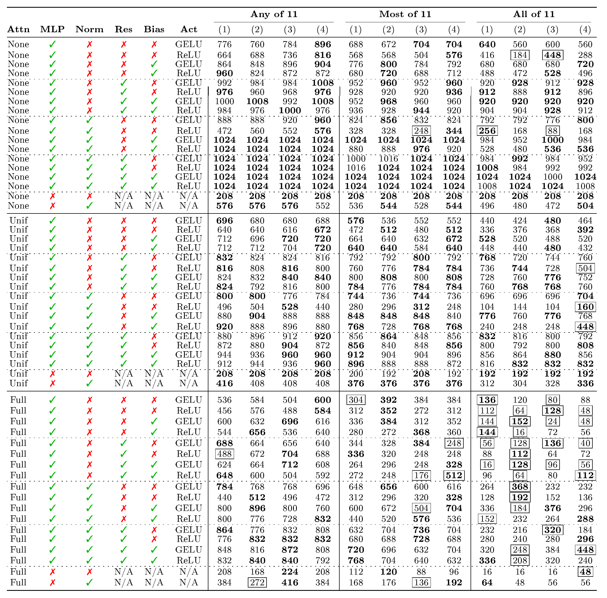

### Mixing
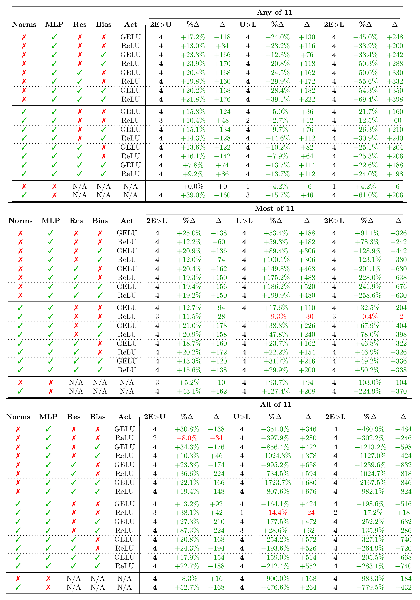
*Table A.1: Dual embedding vs. uniform attention vs. full attention.*

### MLP
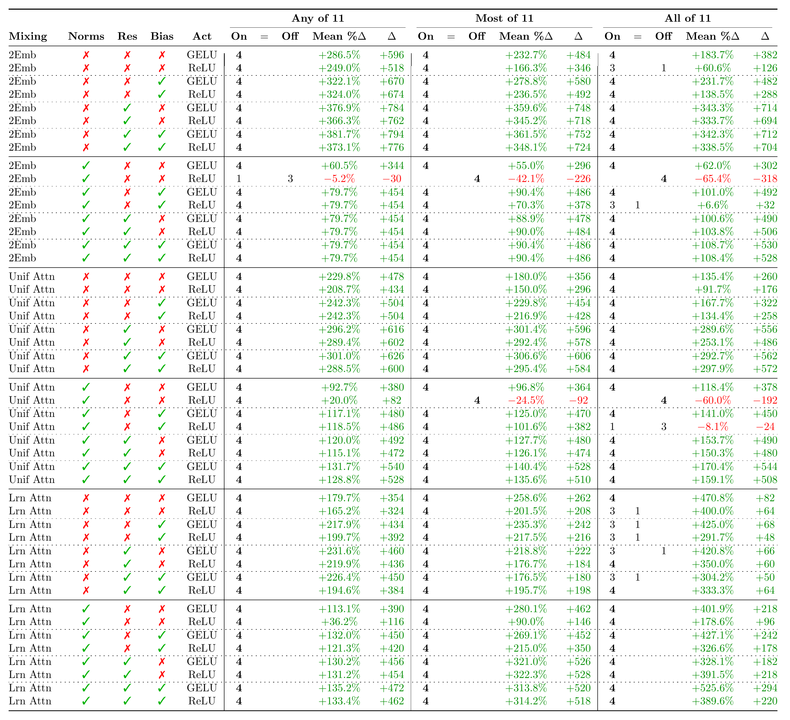
*Table A.2: MLP*

### Norms
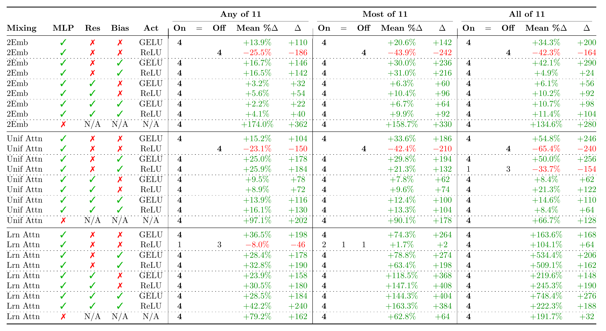
*Table A.3: Norms vs. no norms.*

### Residual connection around the MLP
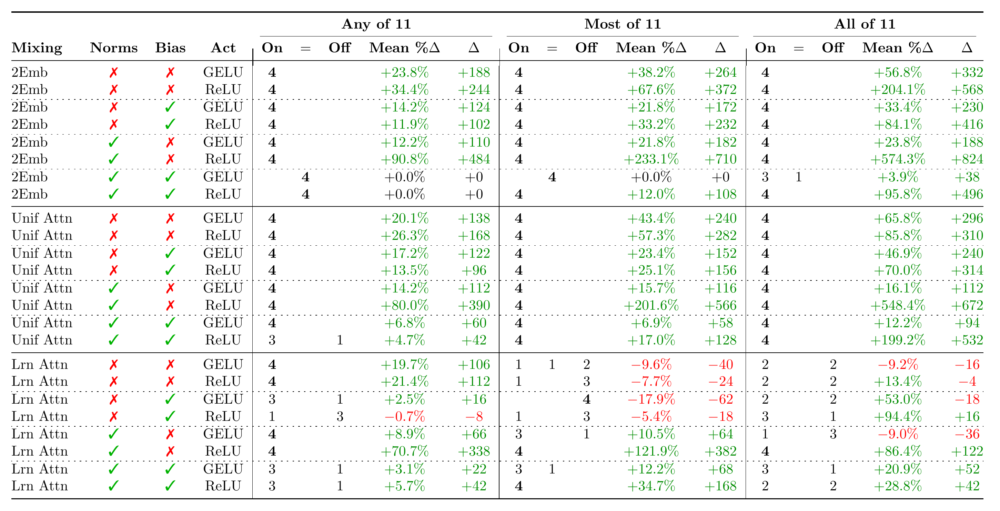
*Table A.4: With vs. without residual connection around the MLP.*

### MLP Bias
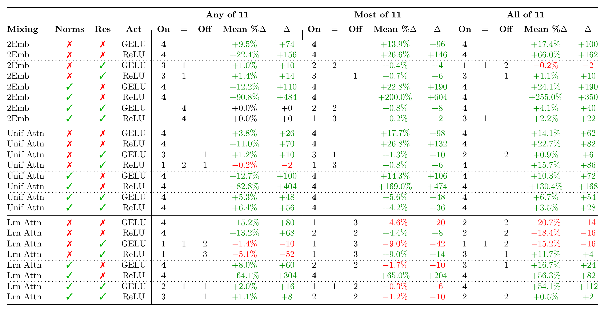
*Table A.5: With vs. Bias in the MLP.*

### MLP Acctivation function
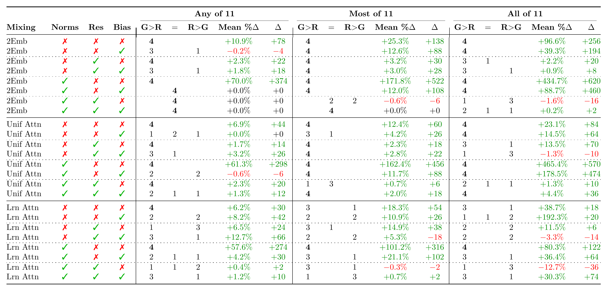
*Table A.6: GELU vs. ReLU.*

# Appendix B: Best S (number neurons per label) for the hand-coded and hybrid models

$S$ is (at least for the hand-coded model) the number of neurons used buy any label. I'm interested in how this scale with various model parameters, since this might give us some clue about what we should expect superpossiton to look like over ReLU and ReLU-like neurons. To be clear, anything we see here is at best a small hint, with no guarantee to have anything do to with how computations are distributed in fully trained models. But it's still a little bit of Baisian evidence, and maybe if it gets to meet up with other evidence later on, it will tell me something. This is why I think this is worth recording.

In the experiments in the main post, in order to get the best version of my hand-coded model, I did a hyperparameter sweep over $S$ and $top\_fraction$. From this I can extract the optimal $S$ for different model sizes by looking at $S$ from the winning ($S$, $top\_fraction$) pair.
 
In the scaling experiments (see main post) I investigated models with dimensions $n_{input\_vocab}=2d$, $d_{MLP}=d$, and $n_{output\_vocab}=d$ for $d\in\{16,32,64,128,256\}$. Looking at the best performing $S$ from these runs we find that $best\_S\approx\sqrt{d}$

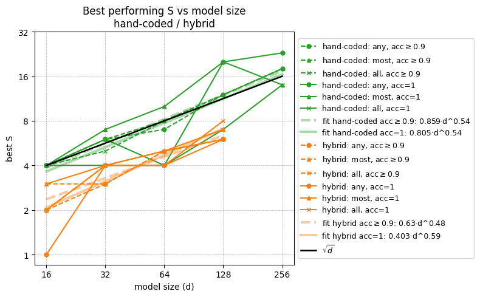

However, in these experiments the relation between $n_{input\_vocab}$, $d_{MLP}$, and $n_{output\_vocab}$ is locked, i.e. we can't tell from the data which of these influences the ideal value of $S$.

In the next experiment I did a binary search for max number of facts for every combination of the following parameters:

- $n_{input\_vocab} \in \{16, 32, 64\}$
- $d_{MLP} \in \{8,16,32,64\}$
- $n_{output\_vocab} \in \{8, 16, 32, 64\}$
- accuracy requirement $\in \{90\%, 100\%\}$
- success aggregation $\in$ {*any, most, all*}
- model type $\in$ {*hand-coded, hybrid*}

Below you can see how the optimal $S$ depends on all of them.

Note that I sweped over $S \in \{1,2,3, \dots, 22\}$. A small number of runs may have hit the sealing, i.e. the optimal value for $S$ is acctualy something above $22$.

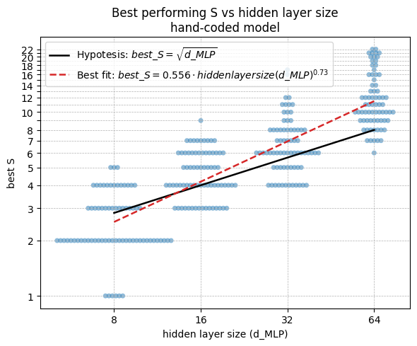

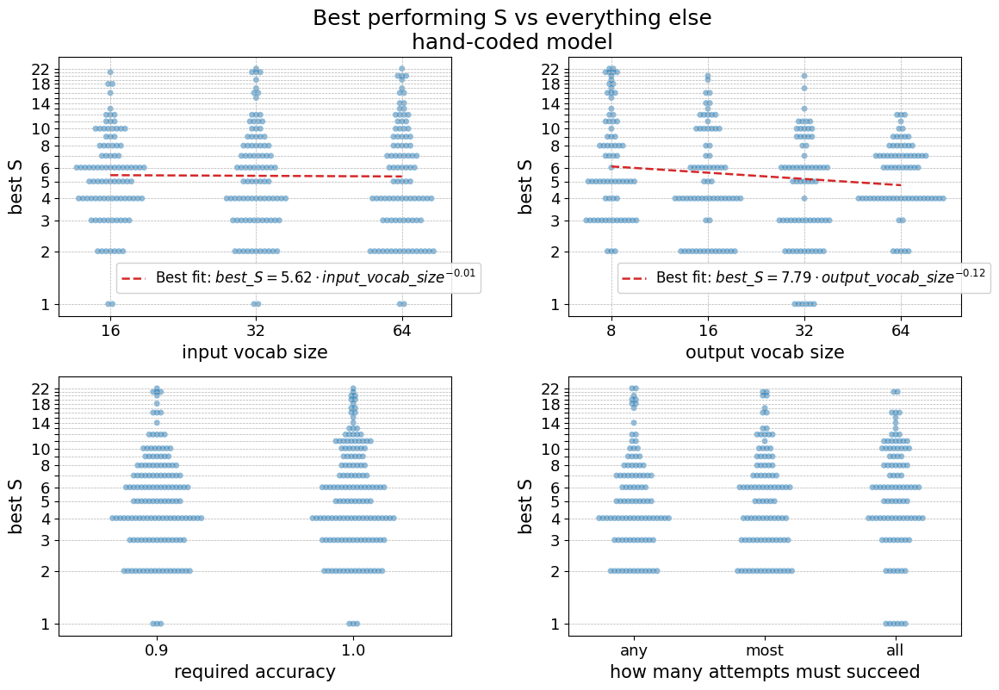

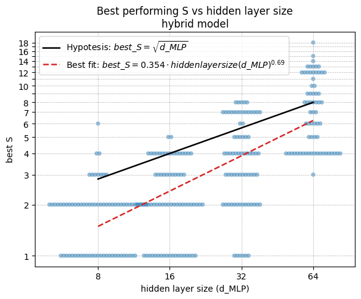

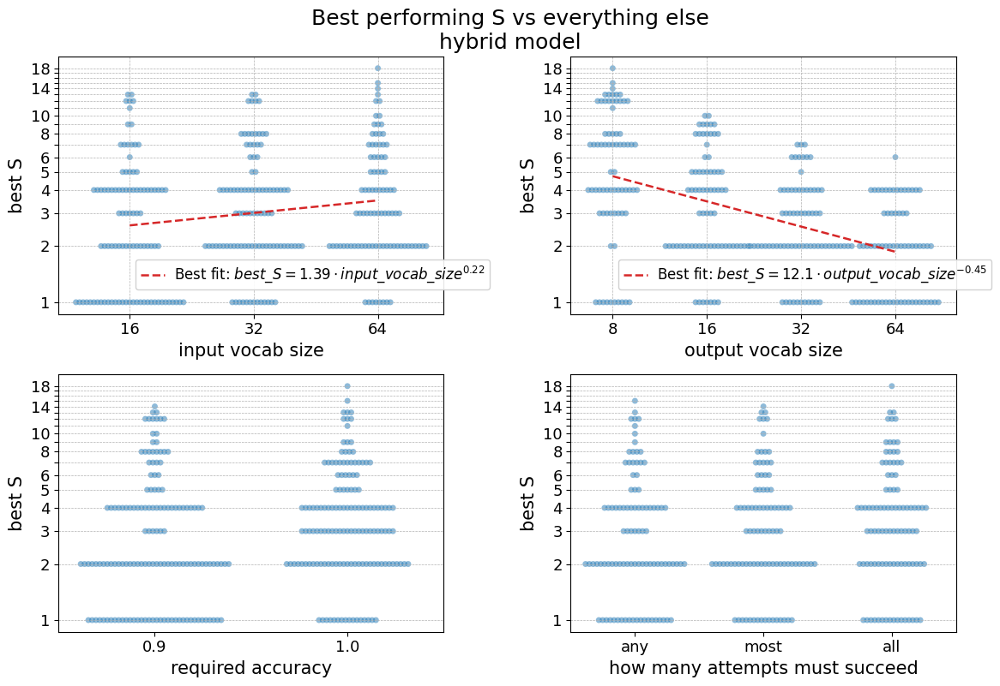

As you can see, the picture is less clean when the diffrent model dimenstions are varried independently. Just scaling up the hidden layer increases the optimal $S$ faster than $\sqrt{d}$. But $S$ also decreses with $n_{output_vocab}$ just enough to add up to the patehrn we see in the first figure (of this appendix section), when they increase toghther.

In the hybrid model $n_{input\_vocab}$ also plays a role. 

# Appendix C: Best "top_fraction" for the hand-coded and hybrid models 

The other hyperparameter (other than $S$), used when creating the embedding matrix for the handcoded and hybrid models, is a variable that I dubbed $top\_fraction$. See main post for definition. 

***I don't expect looking into this variable will tell you anything interesting. I don't recomend that you pay attention to this section unless you know something I don't.***

But for compleetion, and because it's cost me almost no extra work to add this, here are the same plot as in Appendix B, but for $top\_fraction$ instead of $S$.

Note that I only sweped over $top\_fraction\in\{0.00, 0.02, 0.04 \dots 0.38\}$ some runs with the hybrid model seems to have hit the cealing, i.e the real best $top\_fraction$ is somethig above $0.38$.

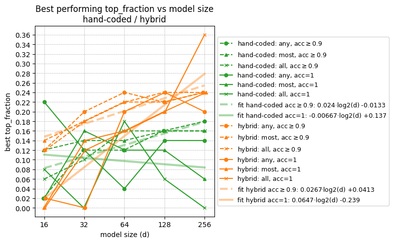

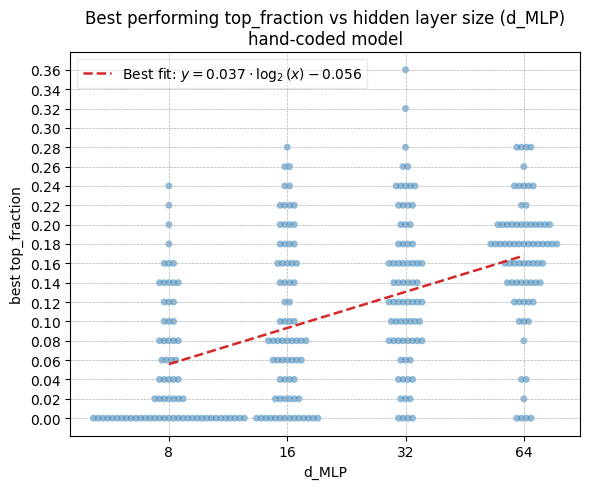

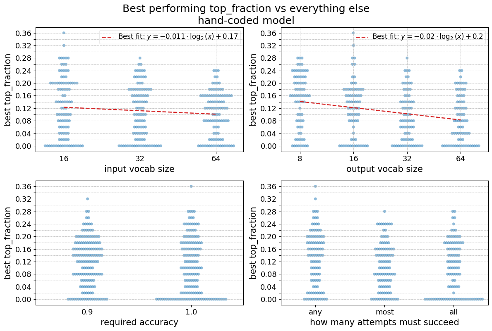

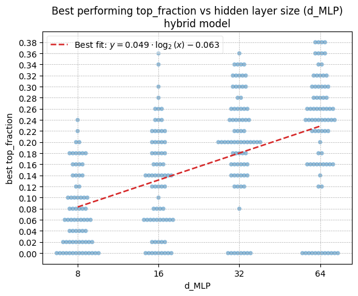

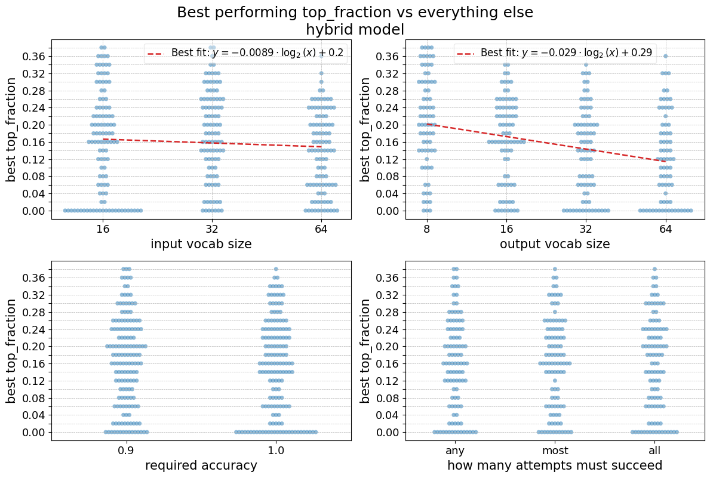